搬瓦工搭建 Shadowsocks 服务器(一键搭建)详细图文教程
========================


## 索引
- [摘要](#摘要)
- [前言](#前言)
- [需要准备的东西](#需要准备的东西)
- [教程开始](#教程开始)
- [搬瓦工套餐](#看看搬瓦工套餐吧)
- [购买搬瓦工](#好啦开始购买搬瓦工)
- [搬瓦工 VPS 操作后台](#进入-搬瓦工-vps-操作后台)
- [安装 Shadowsocks 服务器](#安装-shadowsocks-服务器)
- [机房切换](#机房切换)
- [Mac客户端使用方法](#苹果笔记本-macos-端的使用方法)
- [Android 客户端使用方法](#手机端的使用方法android)
- [iOS 客户端使用方法](#手机端的使用方法ios)
- [手工安装 SSR/SS 服务器](#手工安装-ssrss-服务器)
- [纯手工安装 SSR 服务器](ssr.md)


## 摘要
1. 小白不要恐慌, 只要您看得懂中文, 有初中英文水平, 有支付宝账号, 您就可以在十分钟之内购买一个美国虚拟主机并且在它上面搭好 Shadowsocks 服务器。
2. 本教程似乎洋洋洒洒卷帙浩繁，其实只讲两件事：㈠用支付宝租用美国虚拟主机，㈡在虚拟主机上搭建 Shadowsocks 服务器。
3. 租用主机时，按图索骥一步一步走，最后支付宝付款；安装Shadowsocks服务器时，点三下鼠标就完事。

## 前言

相信来看本文的同学都知道什么是`翻墙`了吧。简而言之，就是：**通过一台位于美国的公网主机，在上面安装特定服务器软件, 我们的手机或电脑就借助这个服务器软件来访问其他网站或服务, 从而规避网络审查的干扰。**
本文专注于详细介绍用 [搬瓦工提供的 VPS](https://bandwagonhost.com/aff.php?aff=12816) 搭建 Shadowsocks 服务器翻墙。

> * 搬瓦工 = 是 bandwagonhost 的音译，一家美国的 VPS 服务商
> * VPS = Virtual private server, 虚拟专用服务器

Shadowsocks 是目前最好的翻墙工具，没有之一，而且电脑、手机通吃。
为什么用搬瓦工搭建 Shadowsocks 服务器？因为性价比高。
最便宜的只要 20 美金一年（不到140人民币），每月 500G 流量，足够十个人无限制翻墙上任何网站，因此您可以与亲友分摊费用。(套餐在下面会详细介绍的)

租用搬瓦工提供的虚拟主机搭建 Shadowsocks 服务器之好处：
* 便宜，比购买各种`专卖VPN的商家的线路`便宜很多，当然如果您非要说网上能搜到很多免费线路我也无话可说，我劝您马上关了本网页。
* 安全，只要您不把您虚拟主机 `IP地址` 泄漏出去被 GFW 截获，就不会被封，而 `VPN商家` 那些主机由于用户成份复杂，被封就是它们必然的宿命。
* 灵活，就算万一您主机IP地址不慎被封，也可以通过简单的 [机房切换](#机房切换) 操作更换 `IP地址`；而且由于您租用的是处于公网上的独立主机，您还可以在这台主机上安装别的任何您想安装的服务器软件，如 `ShadowsocksR`(SSR)， GFW.Press ，甚至数据库服务器，用 `wordpress` 搭建个人网站等等。
* 通用，您的安卓手机、苹果手机、平板电脑、PC台式机，都可以使用同一 `服务器线路`；而 `VPN商家` 则不一定提供全平台通吃的客户端，一般局限在苹果手机平台，应用场景极其单一。

## 需要准备的东西

*   能上网的电脑（废话了）
*   一张银行卡，并且已经开通网银，信用卡也行，~~PayPal 付款的时候需要（说着当然肯定要有钱的呀），~~ 或者支付宝。
*   睁大眼睛看教程，一次不会的话，看多一次，还是不会的话，那再看一次~

## 教程开始~

### 温馨提示

* 由于教程所述搭建翻墙环境的服务器是在美国，速度可能不是很快。
* 由于官网属于被墙的状态，如您在下面点击链接打开官网显示出错，建议您首先用别的方式翻着墙，这是个鸡生蛋蛋生鸡的悖论，各位读者明鉴。
* **这个时候的翻墙，请将您的翻墙客户端切换到全局模式（Global Mode），因为很多客户端没有将 [搬瓦工官网](https://bandwagonhost.com/aff.php?aff=12816) 加入代理列表，导致自动或PAC模式时访问搬瓦工失败。**

    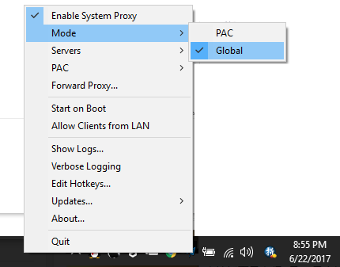

### 现已支持支付宝交易

* 就是说 `搬瓦工` 工作人员知道我们大天朝内太多人们需要从那里购买 VPS 搭建 Shadowsocks 服务器来翻墙。
* 面对这奇葩大天朝，外国佬还是挺会来事儿的，从之前配置了一键安装 Shadowsocks Server 再到现在支持支付宝交易，我大天朝内人们折腾自己搭建翻墙环境又将更加简单化，小白化，也感谢他们官网的机智，了解中国国情。
* 如果你不在意 `有司` 知道你用 `支付宝` 做了些什么, 下面的注册 Paypal 账号教程就跳过吧。当然如果你很在意隐私, 还是仔细地看看 Paypal 教程, 没坏处.

### ~~注册 Paypal 账号~~

*   ~~这是购买搬瓦工付款可选途径。~~
*   ~~`如果您有 Paypal 账号，请确定是国际账号的，国内的 Paypal 是付款不了的`~~
*   ~~`已有 Paypal 国际账号的请跳过这步`~~
*   ~~Paypal 国际账号注册地址：[https://www.paypal.com/c2/home](https://www.paypal.com/c2/home)~~
*   ~~打开之后，选择右上角的`“注册”`~~
*   ~~然后选择`“个人”`——`“立即开始”`~~
*   ~~再然后按照提示填写个人信息，请注意：`注册 PayPal 账户的姓名必须与您的银行账户开户名完全一致`,还有就是如果密码太简单了，是无法创建账号的。~~
*   ~~同意并创建账号—-输入验证码—-`继续`~~
*   ~~设置密码提示问题——`提交`~~
*   ~~之后您就会看到`“祝贺您！您已注册PayPal账户”`,再然后呢，输入您的银行卡号，再选择：`是`，然后：`提交`~~
*   ~~至此您已经完成 Paypal 账号的注册。（^_^ 好简单是不是）~~

### 看看搬瓦工套餐吧

| 名称 | 10G KVM – PROMO | 20G KVM – PROMO |
| --- | --- | --- |
| CPU | 1x Intel Xeon | 2x Intel Xeon |
| 内存 | 512 MB | 1024 MB |
| 硬盘 | 10 GB/SDD RAID-10 | 20 GB/SDD RAID-10 |
| 流量 | 500 GB/月 | 1 TB/月 |
| 带宽 | 1 Gigabit | 1 Gigabit |
| 价格 | 19.99美元/年 | 49.99美元/年 |
| 链接 | [购买](https://bandwagonhost.com/aff.php?aff=12816&pid=43) | [购买](https://bandwagonhost.com/aff.php?aff=12816&pid=44) |

`以上参数均来自官网`

* 上面列出的套餐只是一部分，也是自我搭建 Shadowsocks 服务器推荐的套餐。
* 说着当然，您土豪的话也可以选择其他的套餐，或者购买 `linode` 或者 `DigitalOcean` 的 VPS。
* 有多个套餐，我应该选择哪个啊？
* 如果只是自己一个人用，或者想先体验一下，强烈推荐选择 [套餐1](https://bandwagonhost.com/aff.php?aff=12816&pid=43) 就好，毕竟够用就好，不要浪费。感觉不错的话，是可以升级到其他套餐的。
* 一般来说，如果只是个人普通使用，哪个便宜选哪个；当然，如果您使用量比较多或者想要分享给同学和朋友一起用的话，选择合适的套餐即可。又或者您土豪的话，选择最贵的也行。
* 记住，一分钱一分货。

## 好啦，开始购买搬瓦工

*   火速打开 [官网](https://bandwagonhost.com/aff.php?aff=12816)
*   如果您只想购买最便宜的套餐1，直接点击这个 [链接](https://bandwagonhost.com/aff.php?aff=12816&pid=43) ,出现如下画面.

    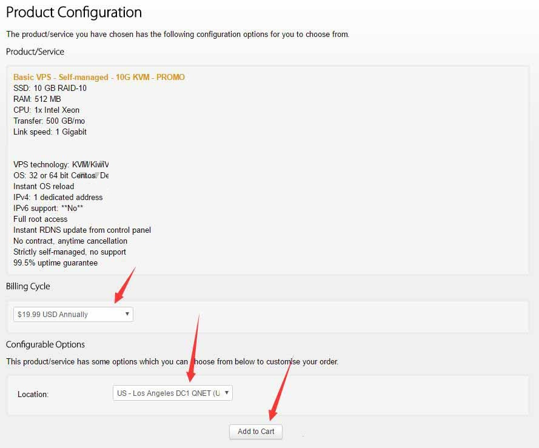

*   需要说明的是：在 `Billing Cycle` 选项那里选择：`$xxx USD Annually`，每年付 XXX 元的意思, 这比按月或者按季度付费要便宜很多。

    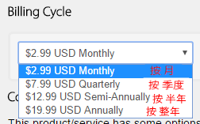

*   其次需要注意的是：在 `location` 选项那里选择 `加拿大`, `荷兰`, `纽约` 等地, 慎选 `洛杉矶`——这是被封的重灾区。毕竟我们选购 VPS 的首选考虑希望它畅通无阻，访问速度还在其次。
*   然后点击`Add To Cart`

    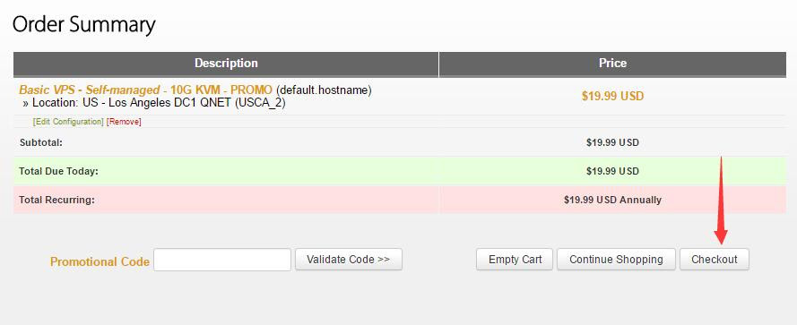

*   再然后点击 `Checkout`
*   提示您要注册账号，请按照下面图片提示来填写~

    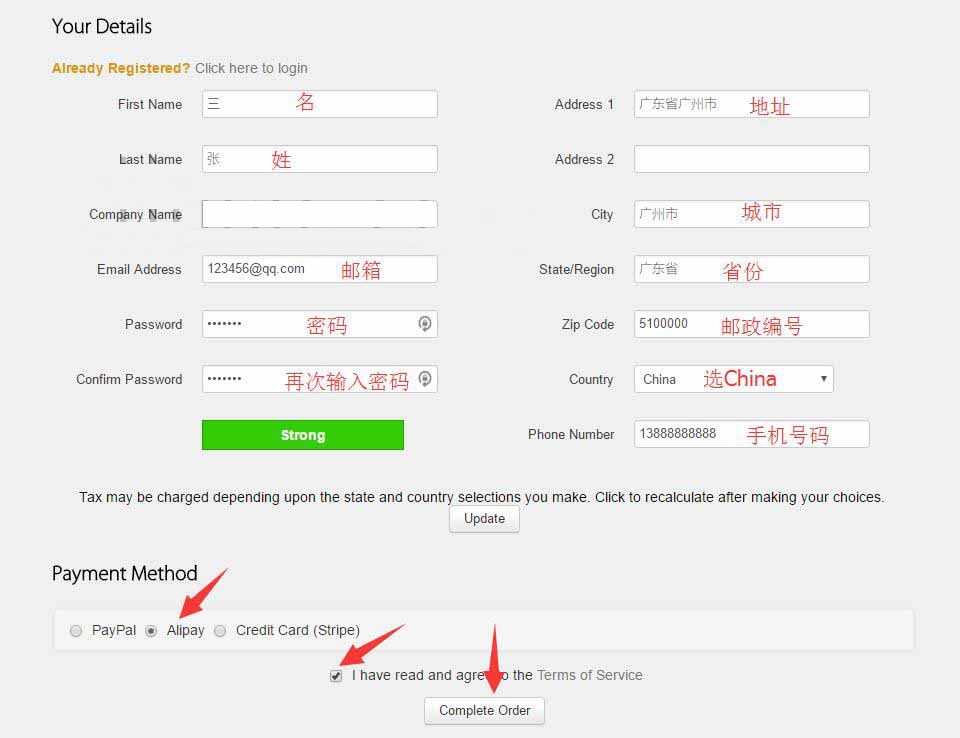

*  图片供参考，要注意的是，`Country` 选项记得选择 `China`。**`电邮`、`密码`，请认真对待并牢记，它就是您在`搬瓦工`上的账号。** 其他信息包括手机号码等，可以随意填写。

*  不要忘了勾上 `I have read and agree to the Terms of Service`。
*  `Payment Method` 的时候选择 `AliPay` 就好！也就是说，`支付方式` 选择 `支付宝`。
*  然后 `Complete Order`。

    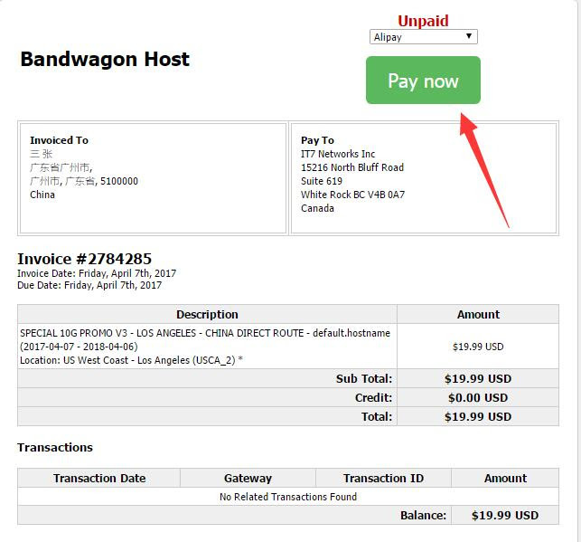

*   再然后 `Pay now`，您就会有看到有 `支付宝` 的登录窗口，支付变得很简单了。下图是支付页面。**支付之前，请再次核对金额是否正确。**

    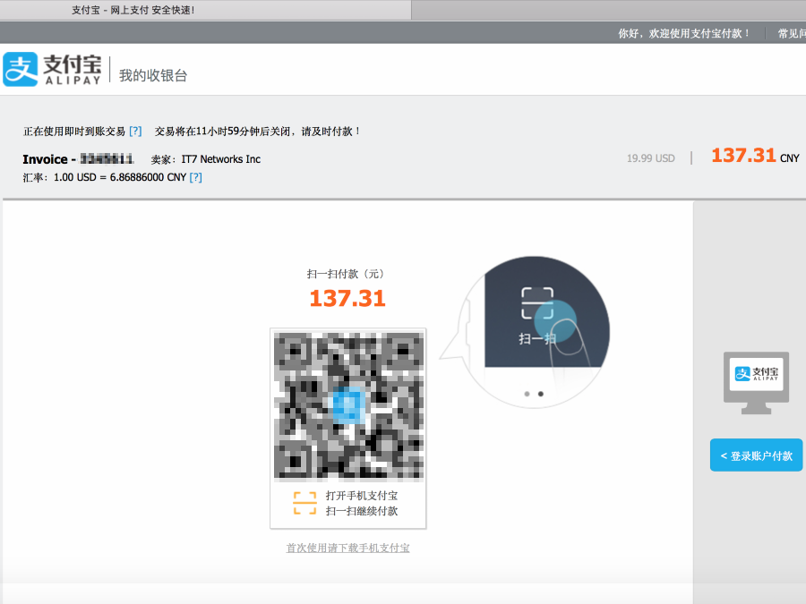

*   ~~如果您选择的是 paypal，并 `Complete Order` 的话~~
*   ~~然后就会自动跳转到 Paypal 付款界面。~~
*   ~~登录此前注册的 Paypal 账号，然后选择 `立即付款`~~
*   ~~下面这是已成功付款的截图^_^~~

    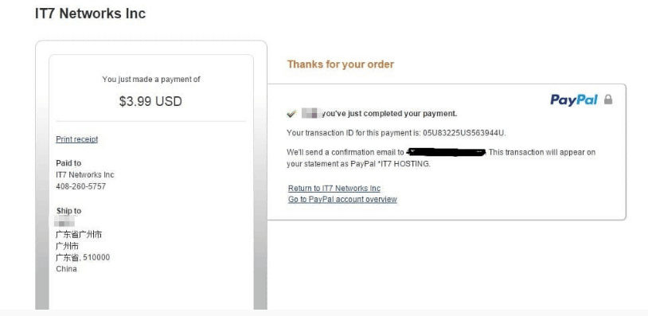

## 进入 搬瓦工 VPS 操作后台

*   确保您已经成功付款之后，请 `Client Area` -> `Services` -> `My Services` 打开 VPS 主机列表页面，或者直接点 [这个连接](https://bandwagonhost.com/clientarea.php?action=products) 打开。 

    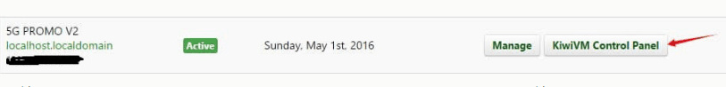

*   选择 `KiwiVM Control Panel`。这时，如果你遇到下图的页面，表明搬瓦工后台对主机的初始化尚未完成，请关闭浏览器，等待大约十分钟，再重新进入 [搬瓦工网站](https://bandwagonhost.com/clientarea.php?action=products)。

    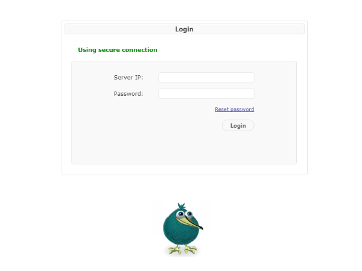

*   下图是首次登录的界面，稍等一会，等待资源分配完成即可。

    

*   这是登录后的界面，里面有详细的关于服务器运行的情况，比如说，流量的使用。这些先不管它，安装 Shadowsocks 服务器先，搬瓦工已经为我们准备好了 Shadowsocks 服务器的安装入口，呵呵，不用打命令了，一键安装。在左下角选择 `Shadowsocks Server`

    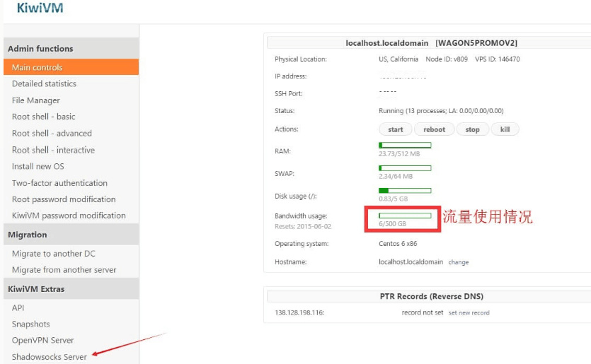
    
*   目前(2018.06.07 之后)多人反应, 搬瓦工后台已经没有了 `Shadowsocks Server` 和 `ShadowsocksR Server` 选项, 为了能简单完成 SS/SSR 安装, 请看本文最后一节. [手工安装 SSR/SS 服务器](#手工安装-ssrss-服务器)

*  如果以上手段都失效了, 那就采用终极解决方案, 
[**纯手工安装 SSR 服务器**](ssr.md),
一步一步地敲入 Linux 命令吧! 这个实际上不难, 克服你对未知领域的 **恐惧**, 足矣. 

## 安装 Shadowsocks 服务器

*   然后选择 `Install Shadowsocks Server`
*   等待安装完成之后选择 `Go Back`
*   下图是 Shadowsocks  服务器运行起来的样子~

    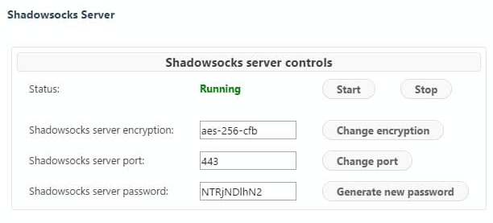

*   至此, Shadowsocks 服务器安装完毕.

## What’s next?（来自搬瓦工说明）

1.  步骤1, 安装Shadowsocks GUI应用程序
2.  Windows 7或更早, 下载[shadowsocks-win-2.3.zip](https://kiwivm.it7.net/dist/shadowsocks-win-2.3.zip)(已安装客户端请忽略)
3.  Windows 8或更高版本,下载[shadowsocks-win-dotne<wbr>t4.0-2.3.zip](https://kiwivm.it7.net/dist/shadowsocks-win-dotnet4.0-2.3.zip)(已安装客户端请忽略)
4.  或者,您可以在开发者的网站下载最新版本:[http://sourceforge.net/projects/shadowsocksgui/files/dist/](http://sourceforge.net/projects/shadowsocksgui/files/dist/)
5.  下载后,提取zip文件并启动Shadowsocks.exe
6.  如果您没有看到如下所示的设置窗口,然后找到Shadowsoc<wbr>ks托盘图标并双击：
7.  步骤2，Shadowsocks GUI设置
8.  进入设置如下所示
9.  请注意,您可以简单地复制粘贴标记为黄色的字段。请务必复制粘贴，否则，你能分辨 l 是 i 还是 L 或者数字 1 吗？

    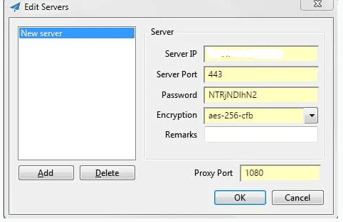

    然后点击确定。

10. 不要忘了勾上`启用系统代理`（鼠标右键 Shadowsocks 托盘图标）.

    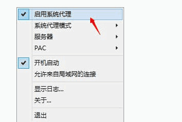

    至此，Shadowsocks 的 Windows 客户端已经安装完毕，尽情的翻墙吧!

11. 如果您想要手机也同时使用这个线路，由于输入密码是个极容易出错的活儿，请照下图所示生成`二维码`，然后用手机上的Shadowsocks客户端软件扫描进去，又快又准。

    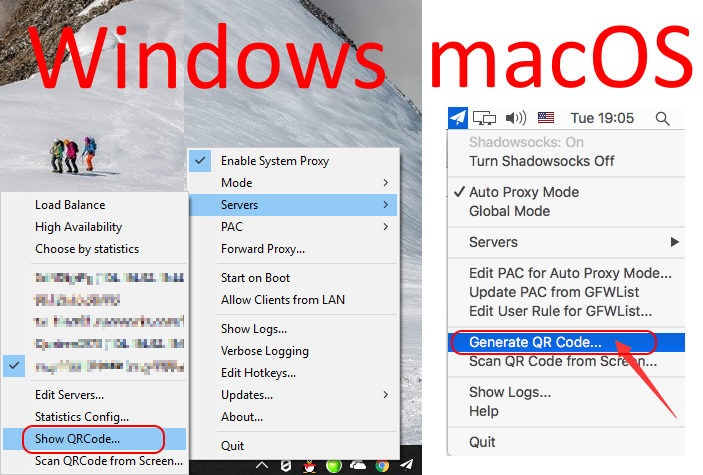

12. 对于 Windows 用户, 最后的最后忠告: **珍爱生命, 远离 360.** 国产杀毒软件, 安全卫士之类垃圾, 百分百是间谍软件, 它们会忠实地将你的翻墙线路, 实时地发送到 GFW 服务器, 然后第一时间将你的翻墙服务器 IP 加入 GFW 黑名单。下面是一些讨论和诅咒，大家严肃点，不准笑。

    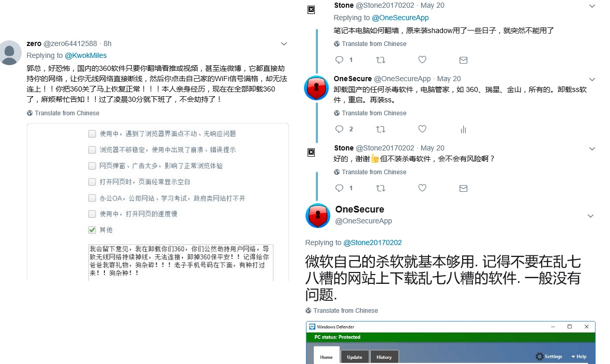


## 一些使用说明

*   我怎么修改 Shadowsocks 服务器的密码？
    答：在Shadowsocks server controls下点击Generate new password
*   我怎么修改Shadowsocks服务器的端口？
    答：在Shadowsocks server controls下点击Change port
*   我怎么修改Shadowsocks服务器的加密方式？
    答：在Shadowsocks server controls下点击Change encryption，然后选择要更改的加密方式之后save，然后Go back
*   我的KiwiVM Control Panel账号是什么呀？
    答：您的服务器IP地址
*   我怎么修改KiwiVM Control Panel密码？
    答：在登录KiwiVM Control Panel界面的时候选择左边KiwiVM password modification，输入新密码后，点击Set new password
*   **服务器运行越来越慢, 怎么办?**
    答: **在控制台主页面, 点 reboot 或者 reset 按钮, 重启整个 VPS 主机.** 一般能解决问题, 重启很快的, 几秒钟就完成. 由于这个操作对改善性能是如此有效, 请记得没事就来一发. 如果还是很慢, 请 [**切换机房**](#机房切换). 

    

## 机房切换

如果您的 IP 不幸被审查部门发现并被屏蔽，您可以切换机房来达到更换 IP 的目的，又或者您仅仅想测试其它机房的速度。如下图所示，首先停掉主机，其次迁移数据到您选定的机房。过几分钟后，关闭您浏览器所有页面，重新登录搬瓦工网站，然后再照下图启动主机，整个操作才算完成。值得注意的是，在进行这些操作的时候，您 **必须用另一条线路翻着墙，否则，你懂的。**

    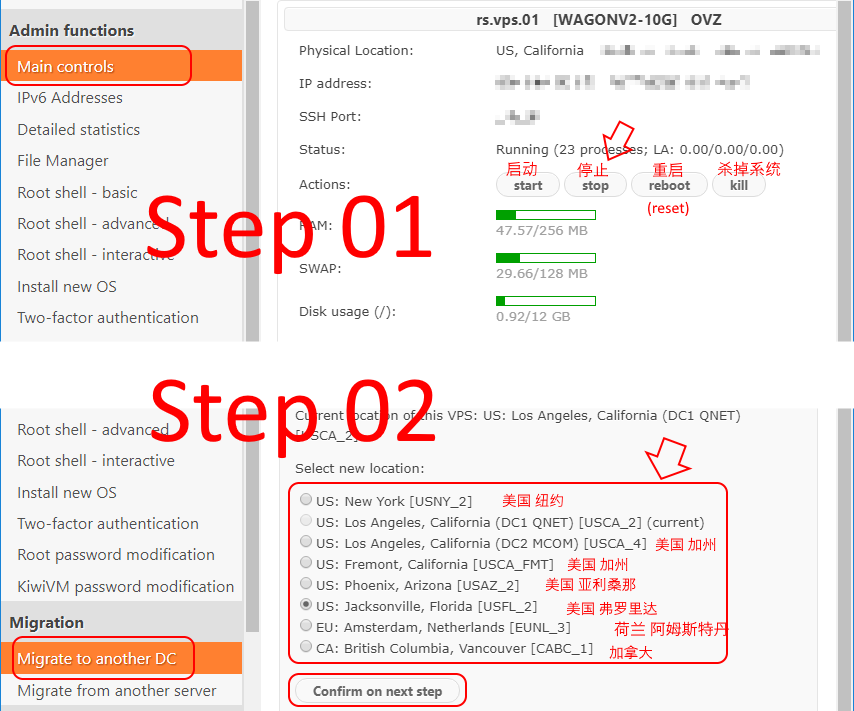


## 苹果笔记本 macOS 端的使用方法

* macOS 的 Shadowsocks 客户端可以在 [这里](https://github.com/shadowsocks/Shadowsocks-ios/releases) 找到, 或者直接点击 [这个链接](https://github.com/shadowsocks/shadowsocks-iOS/releases/download/2.6.3/ShadowsocksX-2.6.3.dmg) 下载 dmg 文件.
* 配置和启用与 Windows 下差不多. 下图是运行结果和配置图.

    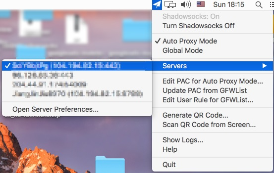
    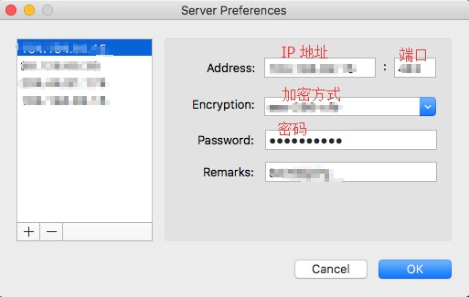


## 手机端的使用方法（Android）

*   [下载地址](https://github.com/shadowsocks/shadowsocks-android/releases)
*   下载完成后，安装，打开。
*   服务器：填写您的服务器IP
*   远程端口：填写您的服务器的远程端口，比如默认是443
*   本地端口：1080
*   密码：填写您的 Shadowsocks 服务器的密码
*   加密方式：选择相对应的加密方式，例如AES-256-CFB或<wbr>者RC4-MD5.
*   路由：选择绕过局域网及中国大陆地址
*   勾上全局代理
*   然后右上角！启用

    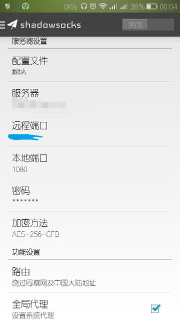


## 手机端的使用方法（iOS）

*   请在苹果 App Store 内下载 [网际飞梭](https://itunes.apple.com/us/app/id982708939?mt=8) 软件.
*   下载完成后，安装，打开, 配置方法与 Android 类似。

    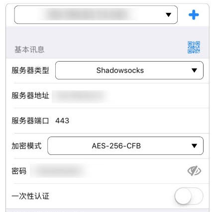


## 手工安装 SSR/SS 服务器

本段讲述 **手工安装 SS/SSR** 服务器方法. 
目前, 搬瓦工并没有删除 SS/SSR 的安装脚本, 只是把后台的安装入口去掉了.
我们只需要在浏览器 `网址输入框` 里输入即可执行安装.


在当前浏览器中输入网址(SSR) 
```bash
https://kiwivm.64clouds.com/main-exec.php?mode=extras_shadowsocksr
```
或者网址(SS)
```bash
https://kiwivm.64clouds.com/main-exec.php?mode=extras_shadowsocks
```
进入界面后，系统会自动运行安装脚本，啥都不用做，等装完后返回就好了，如下：


安装后


## 纯手工安装 SSR 服务器

文章 [纯手工安装 SSR 服务器](ssr.md)
