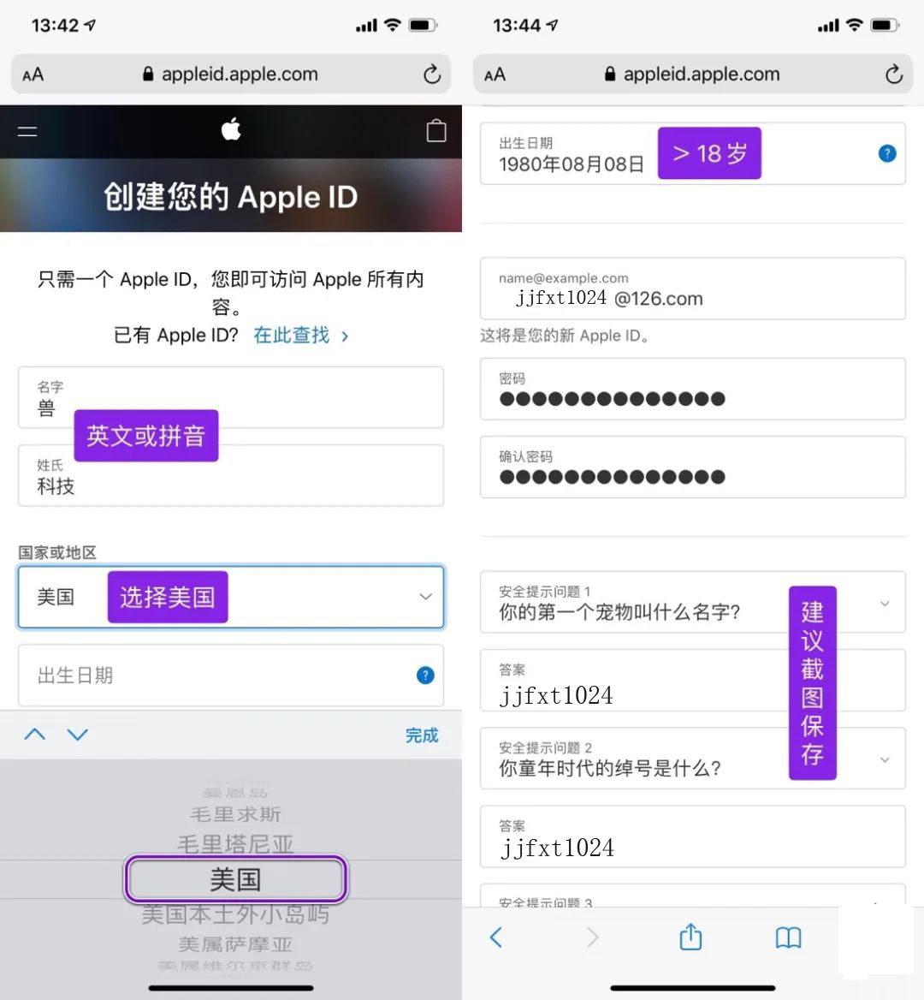
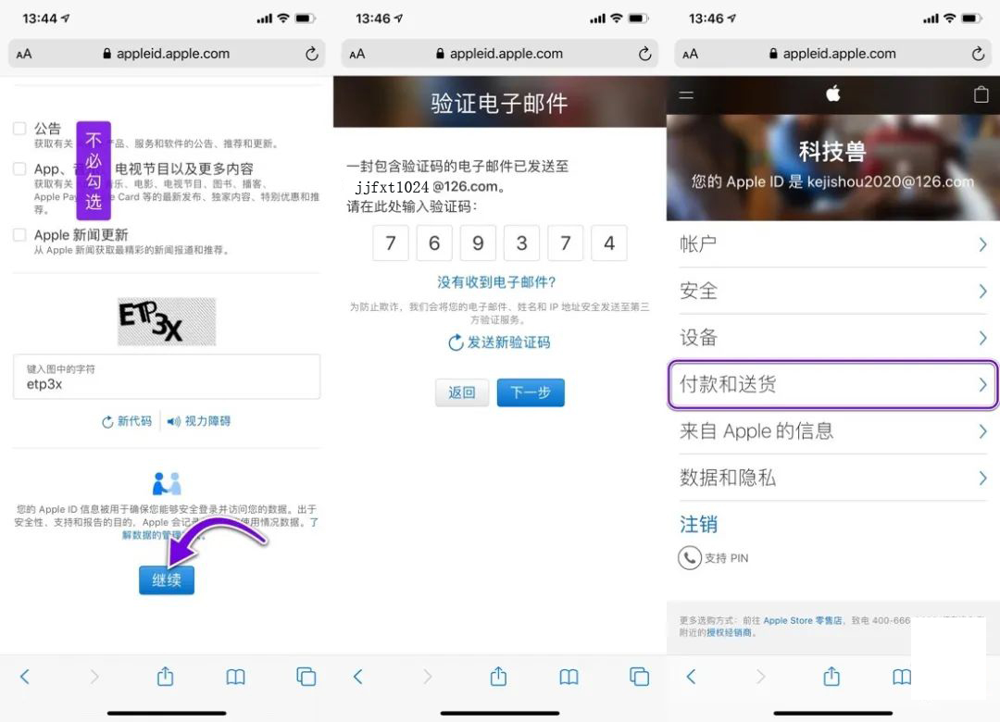
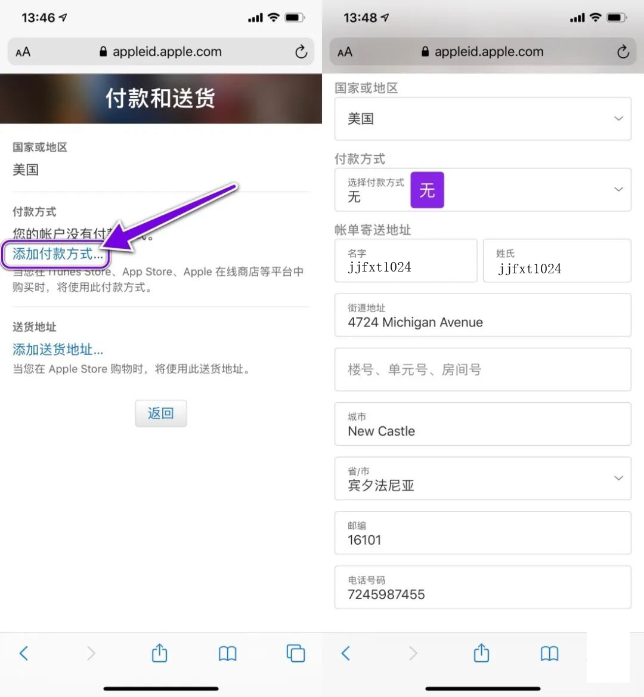
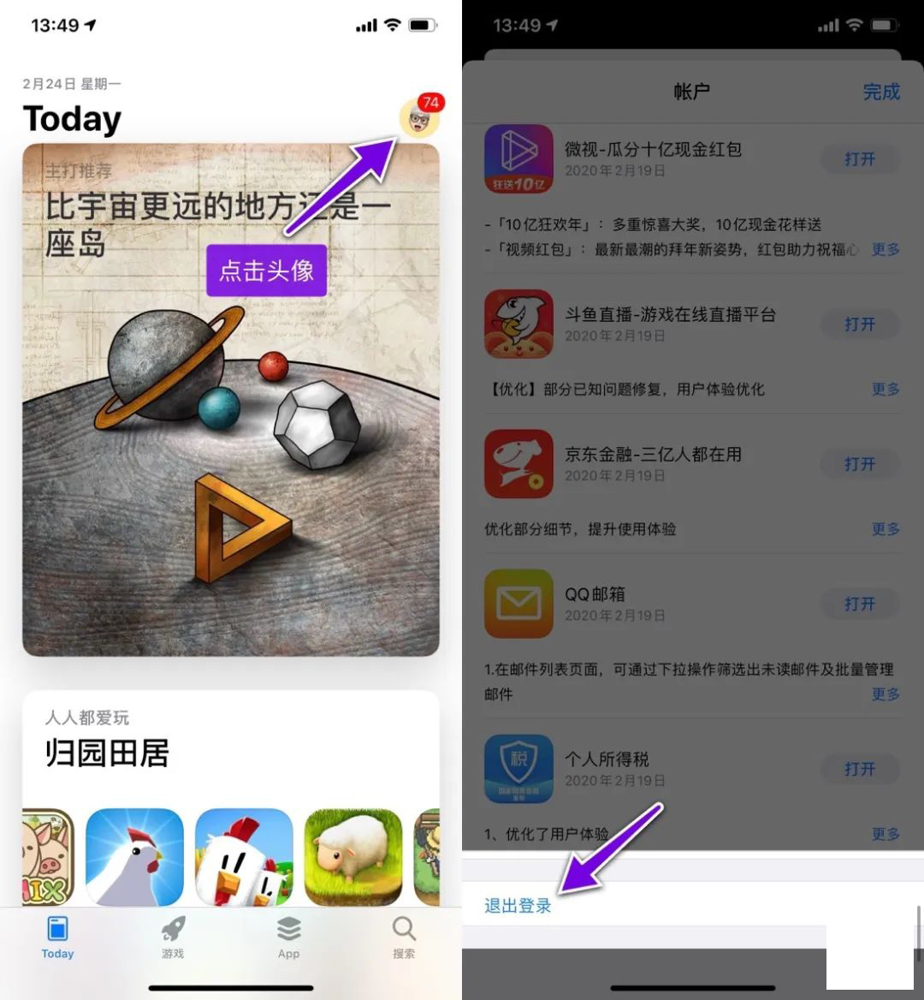
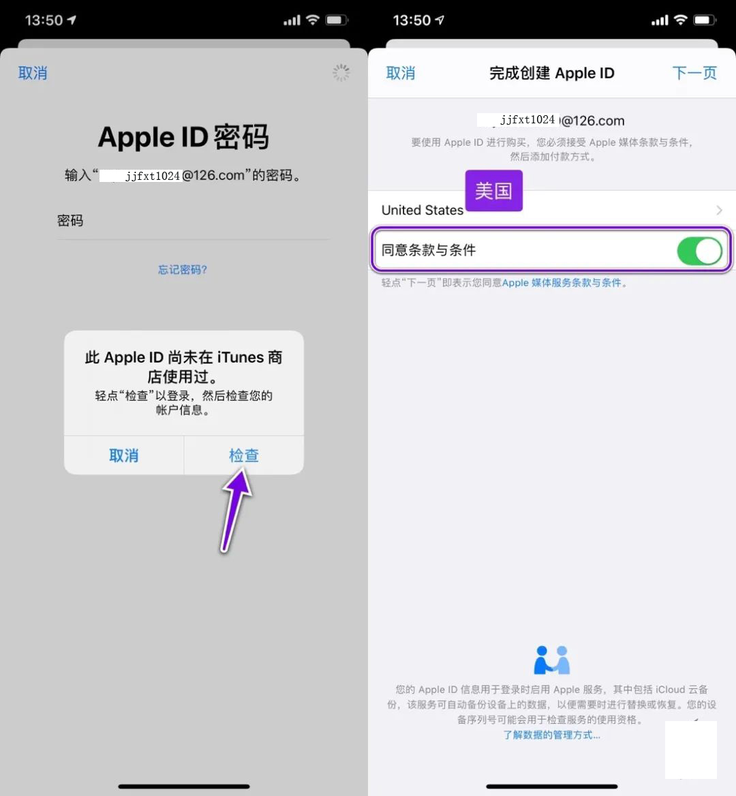
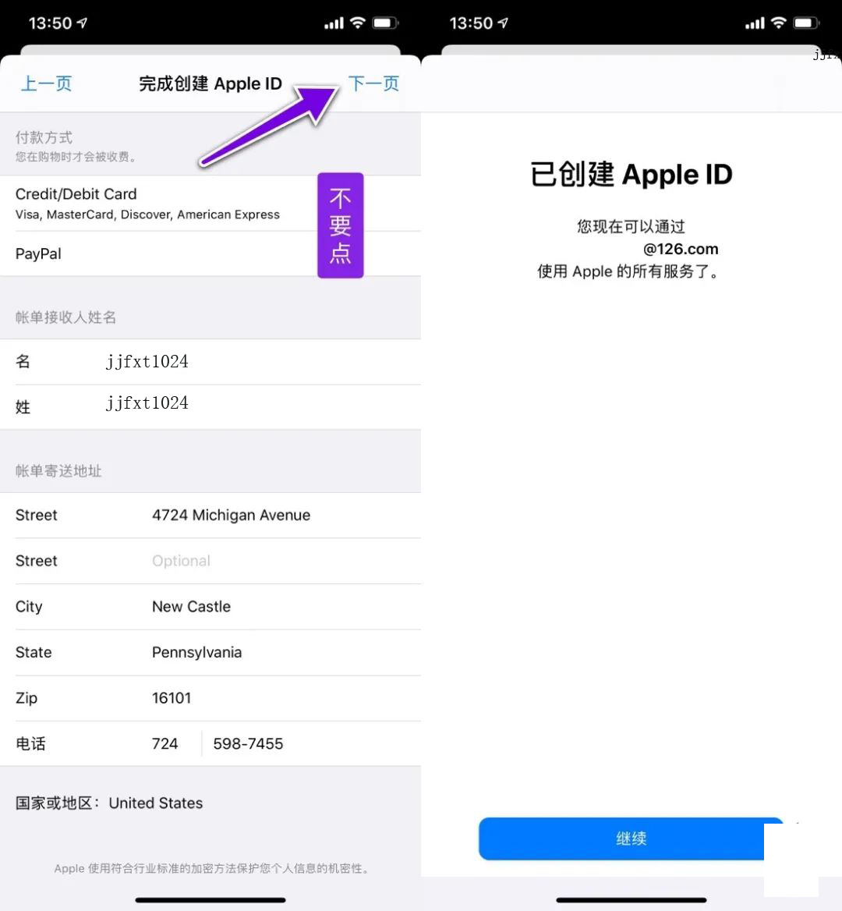
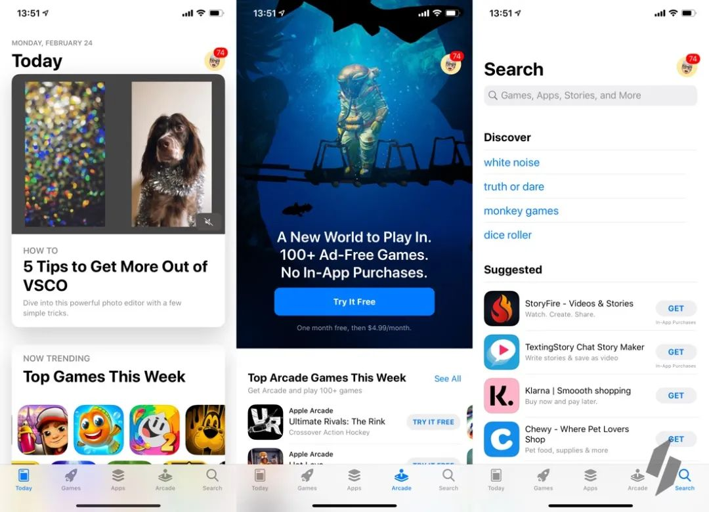

苹果美区AppleID最新注册教程(不需美国IP)
========

[转帖] 新版教程，这是目前注册苹果美区账号最快的方法，适合所有人！

# 第一步：注册新的邮箱账号

先注册一个邮箱账号，国内的 126、qq、163 等等都可以，只要没用它注册过 Apple ID 就行。

# 第二步：通过网页注册

进入苹果 Apple ID 注册页面： https://appleid.apple.com/account#!&page=create

* 姓氏、名字请输入「英文或拼音」
* 国家或地区选择「美国」
* 出生日期大于 18 岁即可

接着，输入邮箱、密码、安全提示问题（建议截图保存）。
页面下方三个选框不必勾选（不然会收到广告邮件），输入验证码之后点击继续即可。

邮箱会收到来自苹果的 6 位数验证码，填写以后点击下一步。来到账号管理页面，点击「付款和送货」选项，点击「添加付款方式」。
* 国家和地区选择「美国」
* 付款方式：「无」
* 街道地址、城市、省、邮编、电话号码可以用网上的“美国地址生成器”生成一个，或者干脆下方图片上的信息。

输入这些信息后保存即可。这样，一个美区 Apple ID 就初步注册完成了。

# 第三步：登录 App Store

打开「App Store」，点击头像进入账户页面，下拉到最底部，退出当前账号。

然后输入刚刚注册的美区账号，因为是第一次登陆，所以点击「检查」。

同意条款与条件，下一步。
* 注意：来到这个页面后，「不要点击付款方式，直接点下一步！」

这样一个美区账号就创建成功了。

App Store 会自动切换到美区英文界面，同时会出现 Arcade 界面（苹果游戏订阅服务）。美区 App Store 使用方法与国区一致，搜索下载应用或游戏安装即可。建议用完退出，再换回国区账号。

# 注意事项 

上述教程「不需要特殊的上网方式」，任何人都可以用这种方法注册美区 Apple ID，不过也有两个问题要特别说明：

1. 如何充值

一些小伙伴可能需要购买美区的 App，但没有办法充值怎么办呢？这就可以求助于万能的某宝（某宝黑卡充值较多，小心被封号，亚马逊美国商店有官方充值，不过需要外币信用卡，如果有的榴友确实想充值但是没外币卡，我有时间可以帮忙，但是要射U额），买美区充值卡就能搞定（注意别买到黑卡）。

2. 切换 App Store 账号的副作用

唯一的副作用：如果你是 Apple Music 用户，切换 App Store 账号会导致已下载的歌曲全部清空。非 Apple Music 用户则没什么影响，账号随便换。

3. 最后的话：

拥有一个属于自己的美区 Apple ID 还是挺有必要的，毕竟一些好用的 App 没有在国区上架，美区账号正好可以作为补充。不过也建议，「不要将美区账号作为主力账号使用」，只有当需要下载美区 App 时再用是最好的，这样即便账号出现问题也不会有太大影响。

