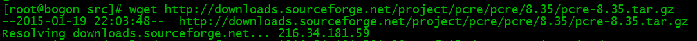
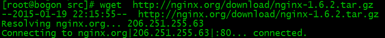

# 全免費 HTTPS 網站 搭建 詳細 图文教程

## 索引
- [Nginx 安装前配置](#nginx-安装前配置)
- [安装 Nginx](#安装-nginx)
- [Nginx 配置](#nginx-配置)
- [启动 Nginx](#启动-nginx)
- [访问站点](#访问站点)
- [Nginx 其他命令](#nginx-其他命令)
- [在 freenom 上申请免费域名](#在-freenom-上申请免费域名)


可能許多人都想過搭建個人網站玩玩，但各種嚇人門檻讓有心探索的人裹足不前。這個搭建過程就值得写写了。
搭建完成的玩具网站是有 `独立域名`, 支持 `HTTPS` 协议的哟. 
会让您有满满的成就感. 也是您进一步建设正经网站的基础.

本文假設您 
- 已經擁有了 VPS(Virtual Private Server 虚拟专用服务器), 
- 知道怎么登录远程虚拟主机, 
- 具有基本的 `linux` 命令操作经验,
- 远程主机的操作系统是 `CentOS 6.x+`.

如果您尚不具备, 请参看 [Vultr 教程](vultr.md).


## Nginx 安装前配置


`Nginx`("engine x") 是由俄罗斯的程序设计师 `Igor Sysoev` 开发的高性能 `Web` 和 `反向代理` 服务器软件, 也是一个 IMAP/POP3/SMTP 代理服务器. 在高连接并发的情况下, `Nginx` 是 `Apache` 服务器不错的替代品.

### 安装编译工具及库文件
```
yum -y install make zlib zlib-devel gcc-c++ libtool  openssl openssl-devel
```

### 首先要安装 PCRE
PCRE 作用是让 Nginx 支持 Rewrite 功能。

- 下载 PCRE 安装包
```
cd /usr/local/src/
wget http://downloads.sourceforge.net/project/pcre/pcre/8.35/pcre-8.35.tar.gz
```  


- 解压安装包
```
tar zxvf pcre-8.35.tar.gz
```
- 进入安装包目录
```
cd pcre-8.35
```
- 编译安装 
```
./configure
make && make install
```
- 查看pcre版本
```
pcre-config --version
```


## 安装 Nginx

- 下载 Nginx
```
cd /usr/local/src/
wget http://nginx.org/download/nginx-1.6.2.tar.gz
```


- 解压 Nginx 安装包
```
tar zxvf nginx-1.6.2.tar.gz
```
- 进入安装包目录
```
cd nginx-1.6.2
```
- 编译安装
```
./configure --prefix=/usr/local/webserver/nginx --with-http_stub_status_module --with-http_ssl_module --with-pcre=/usr/local/src/pcre-8.35
make && make install
```
- 查看 Nginx 版本
```
/usr/local/webserver/nginx/sbin/nginx -v
```


到此，nginx安装完成。

## Nginx 配置

- 站点文件准备. 将 NginX 软件中的示例网页文件复制一份出来到 `/mysite` 文件夹.
```
cp -r  /usr/local/webserver/nginx/html /mysite
```
这样 `/mysite` 文件夹就是你的网页文件放置的地方了.

- 创建 Nginx 运行使用的用户 www
```
groupadd www 
useradd -g www www
```
- 配置 `nginx.conf`, 用 `vi` 软件编辑, 将 `/usr/local/webserver/nginx/conf/nginx.conf` 替换为以下内容
```
user www www;
worker_processes 2; # 设置值和CPU核心数一致.
error_log /usr/local/webserver/nginx/logs/nginx_error.log crit; #日志位置和日志级别.
pid /usr/local/webserver/nginx/nginx.pid;
#Specifies the value for maximum file descriptors that can be opened by this process.
worker_rlimit_nofile 65535;
events
{
  use epoll;
  worker_connections 65535;
}
http
{
  include mime.types;
  default_type application/octet-stream;
  log_format main  '$remote_addr - $remote_user [$time_local] "$request" '
               '$status $body_bytes_sent "$http_referer" '
               '"$http_user_agent" $http_x_forwarded_for';

  #charset gb2312;

  server_names_hash_bucket_size 128;
  client_header_buffer_size 32k;
  large_client_header_buffers 4 32k;
  client_max_body_size 8m;
     
  sendfile on;
  tcp_nopush on;
  keepalive_timeout 60;
  tcp_nodelay on;
  fastcgi_connect_timeout 300;
  fastcgi_send_timeout 300;
  fastcgi_read_timeout 300;
  fastcgi_buffer_size 64k;
  fastcgi_buffers 4 64k;
  fastcgi_busy_buffers_size 128k;
  fastcgi_temp_file_write_size 128k;
  gzip on; 
  gzip_min_length 1k;
  gzip_buffers 4 16k;
  gzip_http_version 1.0;
  gzip_comp_level 2;
  gzip_types text/plain application/x-javascript text/css application/xml;
  gzip_vary on;
 
  #limit_zone crawler $binary_remote_addr 10m;
  # 下面是 server 虚拟主机的配置.
  server
  {
    listen 80;   # 监听端口.
    server_name localhost; # 域名.
    index index.html index.htm index.php;
    root /mysite; # 站点目录.
    
    location ~ .*\.(php|php5)?$
    {
      #fastcgi_pass unix:/tmp/php-cgi.sock;
      fastcgi_pass 127.0.0.1:9000;
      fastcgi_index index.php;
      include fastcgi.conf;
    }
    
    location ~ .*\.(gif|jpg|jpeg|png|bmp|swf|ico)$
    {
      expires 30d;
      # access_log off;
    }
    
    location ~ .*\.(js|css)?$
    {
      expires 15d;
      # access_log off;
    }
    
    access_log off;
  }
}
```
- 检查配置文件 `nginx.conf` 的正确性. 命令
```
/usr/local/webserver/nginx/sbin/nginx -t
```


## 启动 Nginx
Nginx 启动命令如下
```
/usr/local/webserver/nginx/sbin/nginx
```


## 访问站点
从浏览器访问我们配置的站点 `IP`


## Nginx 其他命令
以下包含了 Nginx 常用的几个命令
```
/usr/local/webserver/nginx/sbin/nginx -s reload            # 重新载入配置文件.
/usr/local/webserver/nginx/sbin/nginx -s reopen            # 重启 Nginx.
/usr/local/webserver/nginx/sbin/nginx -s stop              # 停止 Nginx.
```

## 在 freenom 上申请免费域名

- 在域名注册商 [freenom.com](https://www.freenom.com) 网站上注册您的账号并登录, 它提供免费和收费域名注册服务.
- 选择 注册一个新域名(Register a New Domain), 这时会出现个搜索框验证您输入域名的有效性. 我这里随意输入 `amaoagou`(阿猫阿狗), 您得输入您自己的. 


- 然后在可用域名页面列出, 可以选择免费的后缀. 我这里选 `amaoagou.tk`, 点`Get it now!`按钮, 然后在随后出现的购物车上点 `Checkout`.


- 在随后出现的页面是过期时间选项, 选择 `12 Months @ FREE`, 这很重要, 因为默认选项是 3 个月. 然后点击 `Continue` 按钮进入下一步的 `Your Details` 页面.


- 在 `Your Details` 页面输入您的个人信息, 随便输入个假的信息就够了. 
如果你想装得像一点, 可以在 [fakenamegenerator.com](https://www.fakenamegenerator.com/) 网站上生成一个. 
一切就绪以后, 勾选 `I have read and agree to the Terms & Conditions` 复选框, 
点击 `Complete Order` 按钮完成订单.

- 现在, 就可以在 `Services` => `My Domains` 页面看到您刚才注册的免费域名了. 请点击 `amaoagou.tk` 条目下的 `Manage Domain` 按钮, 进入下一步.

- 在 `Managing amaoagou.tk` 页面, 请点击 `Management Tools` 下的 `Nameservers`, 然后选择 `Use custom nameservers (enter below)` 单选按钮. 在下面的输入框中分别输入 `GREG.NS.CLOUDFLARE.COM` 和 `SUE.NS.CLOUDFLARE.COM`, 然后点击 `Change Nameservers` 按钮确认保存. **这一步相当重要**, 原因后面讲.


到这一步, 域名就算注册好了.

