# 全免費 HTTPS 網站 搭建 詳細 图文教程

## 索引
- [Nginx 安装前配置](#nginx-安装前配置)
- [安装 Nginx](#安装-nginx)
- [Nginx 配置](#nginx-配置)
- [启动 Nginx](#启动-nginx)
- [访问站点](#访问站点)
- [Nginx 其他命令](#nginx-其他命令)
- [在 freenom 上申请免费域名和 DNS 解析服务](#在-freenom-上申请免费域名和-dns-解析服务)
- [使用 Let's Encrypt 的免费证书为网站添加 SSL 层](#使用-lets-encrypt-的免费证书为网站添加-ssl-层)
- [全自动申请 Let's Encrypt 免费证书](#全自动申请-lets-encrypt-免费证书)


可能許多人动過念头搭建 `個人網站` 玩玩，但各種嚇人門檻讓有心探索的人裹足不前。這個搭建過程就值得写写了。
搭建完成的玩具网站是有 `独立域名`, 支持 `HTTPS` 协议的哟. 
让您满满的成就感. 也是您进一步建设正式网站的基础.

本文假設您 
- 已經擁有了 VPS(Virtual Private Server 虚拟专用服务器), 
- 知道怎么登录远程虚拟主机, 
- 具有基本的 `Linux` 命令操作经验, 会使用 [vi](vi.md) 软件编辑文本文件, 会用 `ls` 列出当前目录的文件, 
- 远程主机的操作系统是 `ubuntu 18.04+` 或者 `CentOS 6.x+`.

如果您尚不具备以上条件, 请参看 [Vultr 教程](vultr.md) 和 [vi 教程](vi.md).


## Nginx 安装前配置


`Nginx`("engine x") 是由俄罗斯的程序设计师 `Igor Sysoev` 开发的高性能 `Web` 和 `反向代理` 服务器软件, 也是一个 IMAP/POP3/SMTP 代理服务器. 在高连接并发的情况下, `Nginx` 是 `Apache` 服务器不错的替代品.

### 获取系统超级用户权限
```
sudo su
```

### 安装编译工具及库文件
在 CentOS 系统，用如下命令
```
yum -y install make zlib zlib-devel gcc-c++ libtool  openssl openssl-devel
```
在 ubuntu 系统, 请用以下命令
```
apt-get update -y
apt-get install make zlib1g zlib1g-dev build-essential autoconf libtool openssl libssl-dev -y
```

### 首先要安装 PCRE
PCRE 作用是让 Nginx 支持 Rewrite 功能。

- 下载和安装 PCRE 软件包. 下列命令完成了从下载源码包, 解压源码包, 配置编译环境, 编译, 安装, 等一系列操作.
```
wget http://downloads.sourceforge.net/project/pcre/pcre/8.43/pcre-8.43.tar.gz
tar zxvf pcre-8.43.tar.gz
cd pcre-8.43
./configure
make && make install
cd ..
pcre-config --version
```
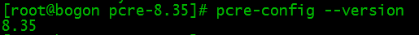

## 安装 Nginx

- 下列命令完成了从下载 nginx 源码包 到编译安装 等一系列动作. 最后一个命令是 查看 Nginx 版本.
```
wget http://nginx.org/download/nginx-1.17.2.tar.gz
tar zxvf nginx-1.17.2.tar.gz
cd nginx-1.17.2
./configure --prefix=/nginx --with-http_stub_status_module --with-http_ssl_module --with-pcre=../pcre-8.43
make && make install
cd ..
/nginx/sbin/nginx -v
```
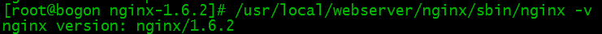

到此，nginx安装完成。

## Nginx 配置

- 站点文件准备. 将 NginX 软件中的示例网页文件复制一份出来到 `/mysite` 文件夹.
```
cp -r  /nginx/html /mysite
```
这样 `/mysite` 文件夹就是您网页文件放置的地方了.

- 创建 Nginx 运行使用的用户 www
```
groupadd www 
useradd -g www www
```
- 配置 `nginx.conf`, 用 [vi](vi.md) 软件编辑将 `/nginx/conf/nginx.conf` 文件内容替换为以下内容，请注意内容中的域名信息。
```
user www www;
worker_processes 2; # The value is the same as the number of CPU cores.
error_log /nginx/logs/nginx_error.log crit; # Log location and log level.
pid /nginx/nginx.pid;
#Specifies the value for maximum file descriptors that can be opened by this process.
worker_rlimit_nofile 65535;
events
{
  use epoll;
  worker_connections 65535;
}
http
{
  include mime.types;
  default_type application/octet-stream;
  log_format main  '$remote_addr - $remote_user [$time_local] "$request" '
               '$status $body_bytes_sent "$http_referer" '
               '"$http_user_agent" $http_x_forwarded_for';

  #charset gb2312;

  server_names_hash_bucket_size 128;
  client_header_buffer_size 32k;
  large_client_header_buffers 4 32k;
  client_max_body_size 8m;
     
  sendfile on;
  tcp_nopush on;
  keepalive_timeout 60;
  tcp_nodelay on;
  fastcgi_connect_timeout 300;
  fastcgi_send_timeout 300;
  fastcgi_read_timeout 300;
  fastcgi_buffer_size 64k;
  fastcgi_buffers 4 64k;
  fastcgi_busy_buffers_size 128k;
  fastcgi_temp_file_write_size 128k;
  gzip on; 
  gzip_min_length 1k;
  gzip_buffers 4 16k;
  gzip_http_version 1.0;
  gzip_comp_level 2;
  gzip_types text/plain application/x-javascript text/css application/xml;
  gzip_vary on;
 
  #limit_zone crawler $binary_remote_addr 10m;
  # Following is the configuration of the server virtual host.
  server
  {
    listen 80;   # listen port.
    server_name localhost amaoagou.tk www.amaoagou.tk; # domain.
    index index.html index.htm index.php;
    root /mysite; # ======> root dirctionay of your site. <======.
    
    #location / {
    #    rewrite ^/(.*)$ https://amaoagou.tk/$1 permanent;
    #}
    
    location ~ .*\.(php|php5)?$
    {
      #fastcgi_pass unix:/tmp/php-cgi.sock;
      fastcgi_pass 127.0.0.1:9000;
      fastcgi_index index.php;
      include fastcgi.conf;
    }
    
    location ~ .*\.(gif|jpg|jpeg|png|bmp|swf|ico)$
    {
      expires 30d;
      # access_log off;
    }
    
    location ~ .*\.(js|css)?$
    {
      expires 15d;
      # access_log off;
    }
    
    access_log off;
  }
}
```
- 检查配置文件 `nginx.conf` 的正确性. 命令
```
/nginx/sbin/nginx -t
```
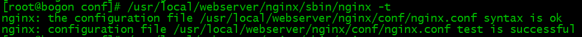

## 启动 Nginx
Nginx 启动命令如下
```
/nginx/sbin/nginx
```
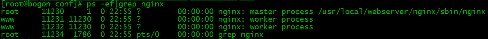

## 访问站点
从浏览器访问我们配置的站点 `IP`

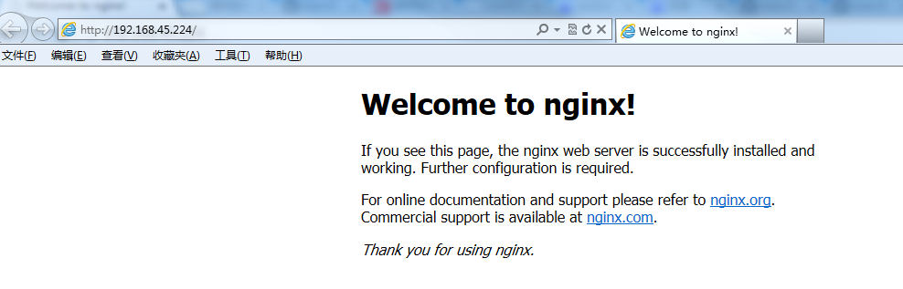

## Nginx 其他命令
以下包含了 Nginx 常用的几个命令
```
/nginx/sbin/nginx -s reload            # 重新载入配置文件.
/nginx/sbin/nginx -s reopen            # 重启 Nginx.
/nginx/sbin/nginx -s stop              # 停止 Nginx.
```

## 在 freenom 上申请免费域名和 DNS 解析服务

- 在域名注册商 [freenom.com](https://www.freenom.com) 网站上注册您的账号并登录, 它提供免费和收费域名注册服务.
- 选择 注册一个新域名(Register a New Domain), 这时会出现个搜索框验证您输入域名的有效性. 我这里随意输入 `amaoagou`(阿猫阿狗), 您得输入您自己的. 

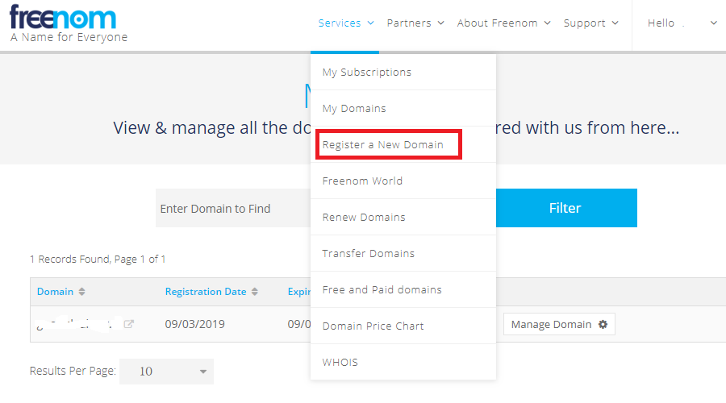

- 然后在可用域名页面列出, 可以选择免费的后缀. 我这里选 `amaoagou.tk`, 点`Get it now!`按钮, 然后在随后出现的购物车上点 `Checkout`.

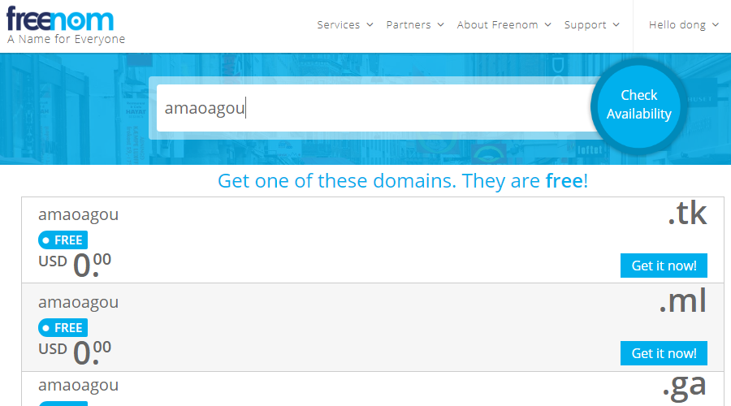

- 在随后出现的页面是过期时间选项, 选择 `12 Months @ FREE`, 这很重要, 因为默认选项是 3 个月. 然后点击 `Continue` 按钮进入下一步的 `Your Details` 页面.

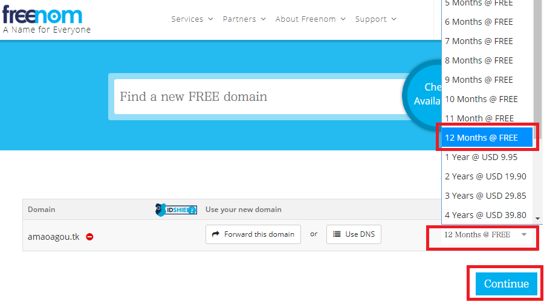

- 在 `Your Details` 页面输入您个人信息, 随便输入个假的信息就够了. 
如果您想装得像一点, 可以在 [fakenamegenerator.com](https://www.fakenamegenerator.com/) 网站上生成一个. 
一切就绪以后, 勾选 `I have read and agree to the Terms & Conditions` 复选框, 
点击 `Complete Order` 按钮完成订单.

- 现在, 就可以在 `Services` => `My Domains` 页面看到您刚才注册的免费域名了. 请点击 `amaoagou.tk` 条目下的 `Manage Domain` 按钮, 进入下一步.

- 在 `Managing amaoagou.tk` 页面, 点击 `Manage Freenom DNS` 项. 在随后出现的页面添加两条记录. 一条 `空白` 记录, 一条 `www` 记录. 
添加方法是, 在 `Name`格子空着或输入字符, 在 `Target` 格子输入您 `VPS` 的 `IP`, 然后点击 `Save Changes` 按钮, 就添加上了. 
几分钟后应该就能生效, 可以 `ping` 出域名的 `IP` 了. 如下图.

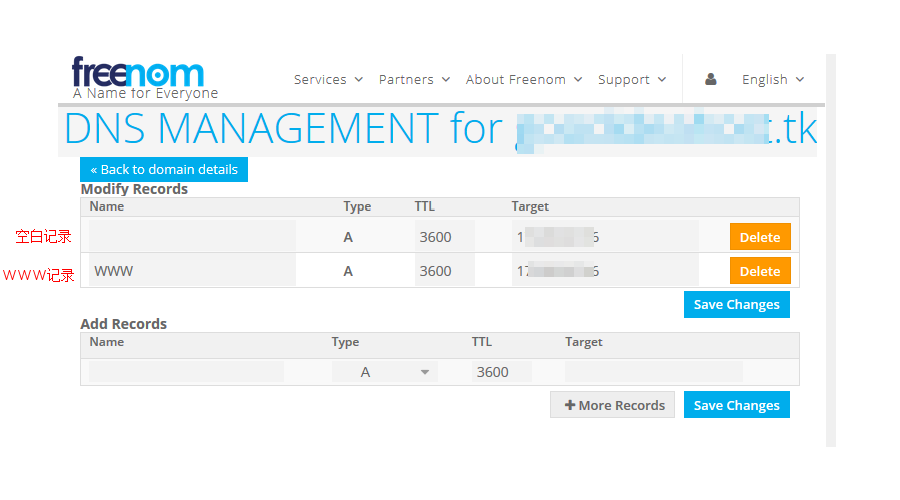

<!--
 - 如果你不使用`Freenom`的域名解析, 可以看下面带删除线的这段. 在 `Managing amaoagou.tk` 页面, 请点击 `Management Tools` 下的 `Nameservers`, 然后选择 `Use custom nameservers (enter below)` 单选按钮. 在下面的输入框中分别输入 `greg.ns.cloudflare.com` 和 `sue.ns.cloudflare.com`, 然后点击 `Change Nameservers` 按钮确认保存. **这一步相当重要**, 原因后面讲.

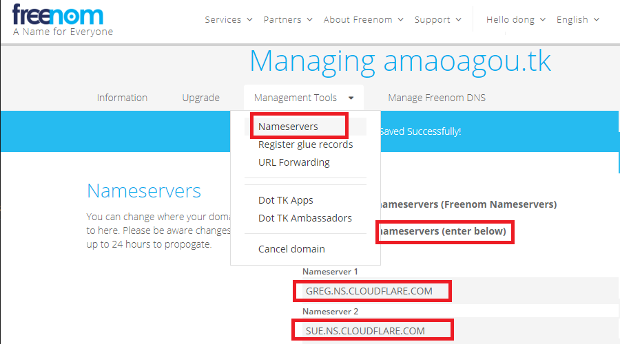 

到这一步, 域名就算注册好了.

## 在 cloudflare 上进行域名 DNS 解析 

- 在 [cloudflare.com](http://cloudflare.com) 网站上注册账号并登入. 
- 在登入后的首页点击 `Add a Site` 按钮并输入您刚注册的 域名 `amaoagou.tk`, 
- 在随后出现的 `Select a Plan` 选择 `FREE` ($0/month) 免费计划, 然后点击 `Confirm plan` 完成添加网站的工作. 
- 下一步出现的 `DNS` 设置页面, 加入两条记录, 分别以 `amaoagou.tk` 和 `www.amaoagou.tk` 为名称, 以及您安装 `nginx` 软件的主机的 `IP` 地址. 如下图. 

 

至此, 您的网站和域名解析就达成了. 您现在知道在 `freenom` 网站上填 `*.cloudflare.com` 的原因了吧! 

-->

几分钟之后, 请在命令行 `ping` 您的域名, 不出意外的话应该可以 `ping` 通. 命令: `ping amaoagou.tk`

而且在浏览器里输入域名 `amaoagou.tk` 应该也可以访问了. 当然, 这时候的网站协议是 `HTTP` 而不是 `HTTPS`. 下一步我们就来完成这个工作.

## 使用 Let's Encrypt 的免费证书为网站添加 SSL 层

[Let's Encrypt](https://letsencrypt.org/) 这个免费、自动化、开放的证书签发服务, 是由 `ISRG`（`Internet Security Research Group`，互联网安全研究小组）提供的. 而 `ISRG` 是来自于美国加利福尼亚州的一个公益组织。`Let's Encrypt` 得到了 `Mozilla`、`Cisco`、`Akamai`、`Electronic Frontier Foundation` 和 `Chrome` 等众多公司和机构的支持，发展十分迅猛。

申请 `Let's Encrypt` 证书不但免费，还非常简单，虽然每次只有 `90` 天的有效期，但可以通过脚本定期更新，配好之后一劳永逸。

### 创建帐号
- 在您的 `VPS` 主机上, 创建一个文件夹 `ssl` 来存放各种临时文件和最后的证书文件。进入这个目录，创建一个 `RSA` 私钥用于 `Let's Encrypt` 识别您身份：
```
mkdir /ssl
cd /ssl
openssl genrsa 4096 > account.key
```
### 创建 CSR 文件
接着就可以生成 `CSR`（`Certificate Signing Request`，证书签名请求）文件了。在这之前，还需要创建域名私钥（一定不要使用上面的账户私钥）。
- 创建 `RSA` 私钥：
```
openssl genrsa 4096 > domain.key
```
- 有了私钥文件，就可以生成 `CSR` 文件了。在 `CSR` 中推荐至少把域名带 `www` 和不带 `www` 的两种情况都加进去，其它子域可以根据需要添加（目前一张证书最多可以包含 `100` 个域名）, 下面使用交互方式创建 `CSR`（需要注意 `Common Name` 必须为您的域名）：
```
openssl req -new -sha256 -key domain.key -out domain.csr
```
当然, 您也可以用一条全自动命令完成创建 `CSR` 文件, 两者选一即可. 注意要把命令中的 `amaoagou.tk` 字符串换成您自己的域名.
```
openssl req -new -sha256 -key domain.key -subj "/" -reqexts SAN -config <(cat /etc/ssl/openssl.cnf <(printf "[SAN]\nsubjectAltName=DNS:amaoagou.tk,DNS:www.amaoagou.tk")) > domain.csr
```

### 配置验证服务
我们知道，`CA` 在签发 `DV（Domain Validation）`证书时，需要验证域名所有权。传统 `CA` 的验证方式一般是往 `admin@yoursite.com` 发验证邮件，而 `Let's Encrypt` 是在您的服务器上生成一个随机验证文件，再通过创建 `CSR` 时指定的域名访问，如果可以访问则表明您对这个域名有控制权。

首先创建用于存放验证文件的目录，命令如下：
```
mkdir -p /mysite/.well-known/acme-challenge/
```
这个目录是让 `Let's Encrypt` 在您主机上 通过 `nginx` 写入一些信息的.
这个验证服务以后更新证书还要用到，因此这个目录必须一直保留, 不能删除。

### 获取网站证书
先把 `acme-tiny` 脚本保存到之前的 `ssl` 目录：
```
wget https://raw.githubusercontent.com/diafygi/acme-tiny/master/acme_tiny.py
```
指定账户私钥、`CSR` 以及验证目录，执行脚本：
```
python acme_tiny.py --account-key ./account.key --csr ./domain.csr --acme-dir /mysite/.well-known/acme-challenge/ > ./signed.crt
```
如果一切正常，当前目录下就会生成一个 `signed.crt`，这就是申请好的证书文件。

搞定网站证书后，还要下载 `Let's Encrypt` 的中间证书。配置 `HTTPS` 证书时既不要漏掉中间证书，也不要包含根证书。
在 `Nginx` 配置中，需要把中间证书和网站证书合在一起：
```
wget -O - https://letsencrypt.org/certs/lets-encrypt-x3-cross-signed.pem > intermediate.pem
cat signed.crt intermediate.pem > chained.pem
```
为了后续能顺利启用 `OCSP Stapling`，我们再把根证书和中间证书合在一起：
```
wget -O - https://letsencrypt.org/certs/isrgrootx1.pem > root.pem
cat intermediate.pem root.pem > full_chained.pem
```
最终，用 [vi](vi.md) 修改 `Nginx` 中有关证书的配置, 在配置文件 `/nginx/conf/nginx.conf` 加入一个新的 `server` 节区:
```
  server
  {
    listen 443 ssl;
    server_name amaoagou.tk www.amaoagou.tk;
    index index.html index.htm index.php;
    root /mysite;

    ssl_protocols       TLSv1 TLSv1.1 TLSv1.2;
    ssl_ciphers         AES128-SHA:AES256-SHA:RC4-SHA:DES-CBC3-SHA:RC4-MD5;
    ssl_certificate     /ssl/chained.pem;
    ssl_certificate_key /ssl/domain.key;
    ssl_session_cache   shared:SSL:10m;
    ssl_session_timeout 10m;
  }
```
然后 `reload` 服务
```
/nginx/sbin/nginx -s reload
```
目前为止, 这个玩具网站已经是 `HTTPS` 加持的了. 恭喜您解锁了新成就. 请看下图.

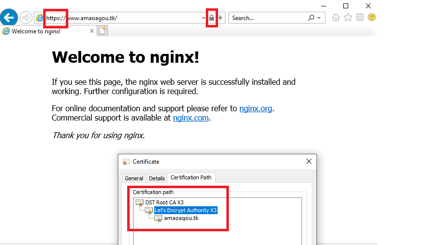

### 配置自动更新
`Let's Encrypt` 签发的证书只有 `90` 天有效期，推荐使用脚本定期更新。用 [vi](vi.md) 创建一个 `renew_cert.sh` 脚本文件并通过 `chmod a+x renew_cert.sh` 赋予执行权限。
```
cd /ssl
vi renew_cert.sh
chmod a+x renew_cert.sh
```

`renew_cert.sh` 文件内容如下：

```
#!/bin/bash

cd /ssl/
python acme_tiny.py --account-key ./account.key --csr ./domain.csr --acme-dir /mysite/.well-known/acme-challenge/ > ./signed.crt || exit
wget -O - https://letsencrypt.org/certs/lets-encrypt-x3-cross-signed.pem > intermediate.pem
cat signed.crt intermediate.pem > chained.pem
/nginx/sbin/nginx -s reload
```
`crontab` 中使用绝对路径比较保险，`crontab -e` 加入以下内容：
```
0 0 1 * * /ssl/renew_cert.sh >/dev/null 2>&1
```
这样以后证书每个月都会自动更新，一劳永逸。实际上，`Let's Encrypt` 官方将证书有效期定为 90 天一方面是为了更安全，更重要的是鼓励用户采用自动化部署方案。

## 全自动申请 Let's Encrypt 免费证书
* 网站 https://www.sslforfree.com/
* 教程 https://www.youtube.com/watch?v=_1NijkYwSK0
