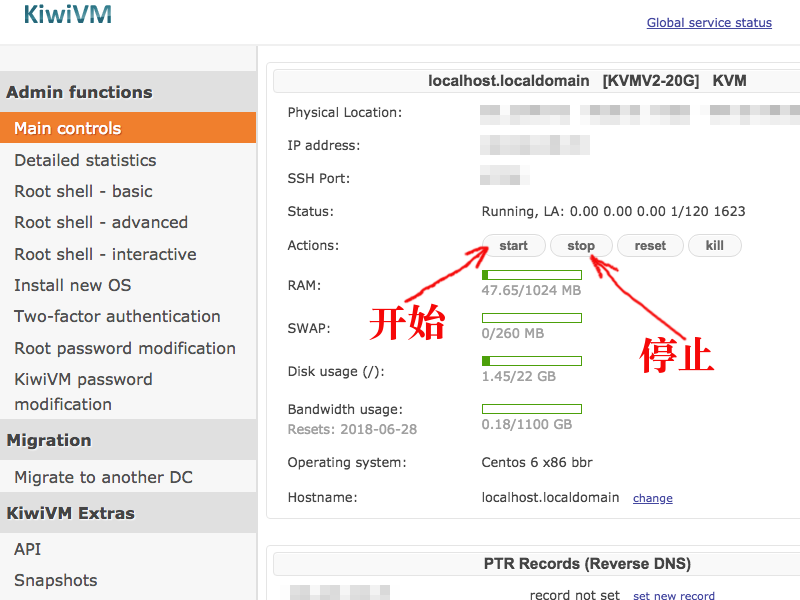
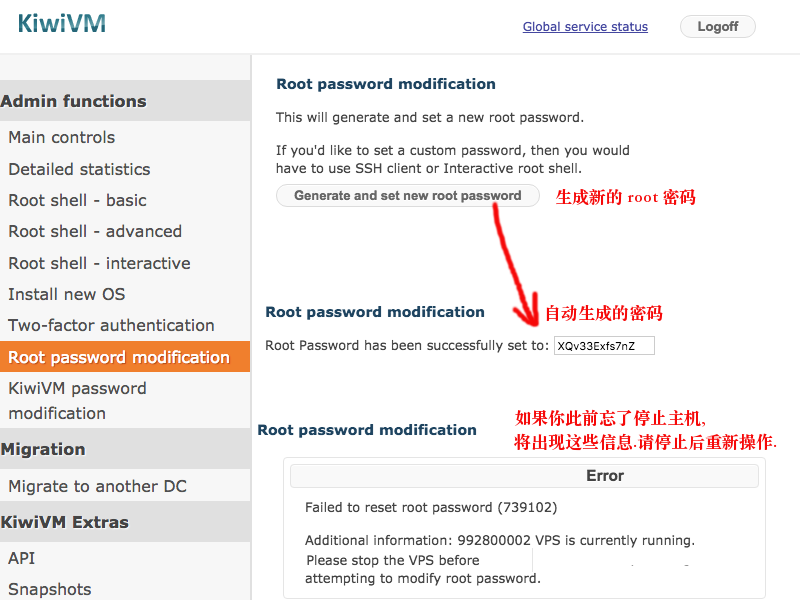
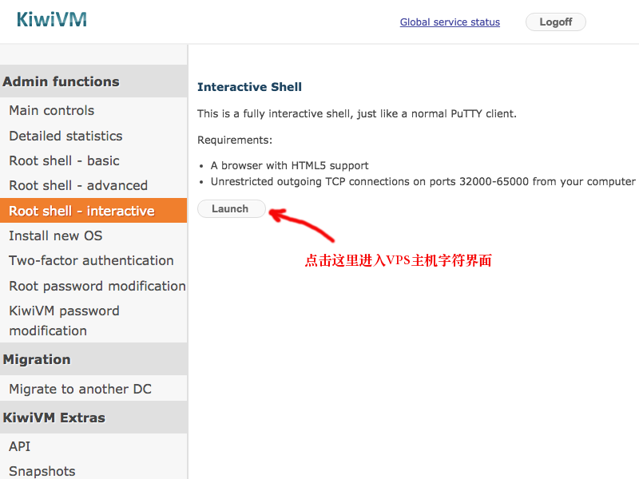
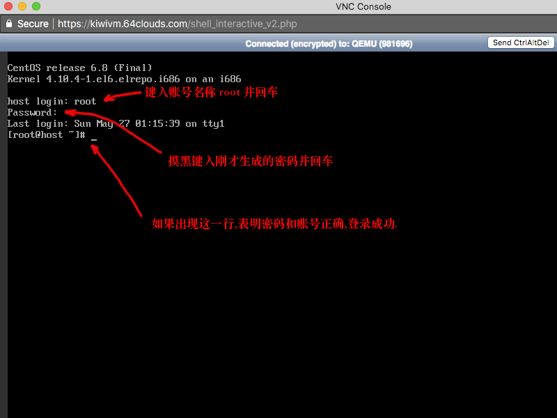
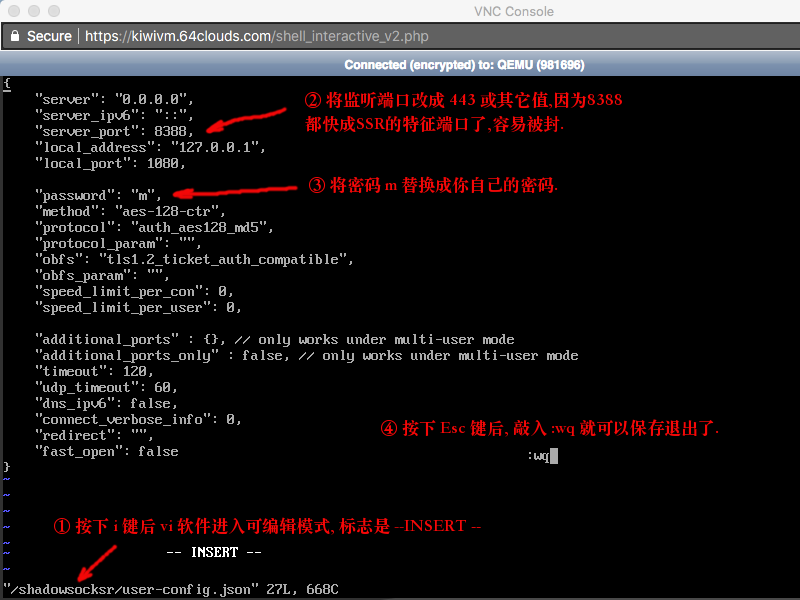
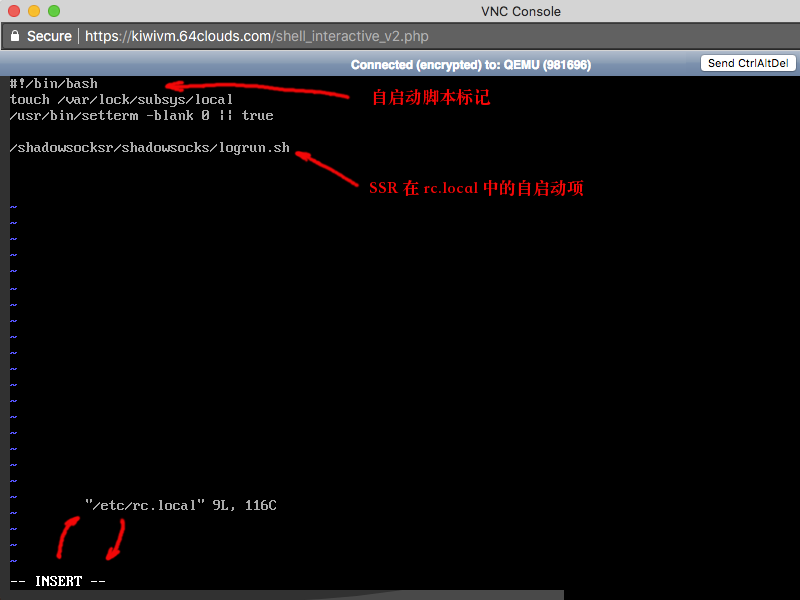
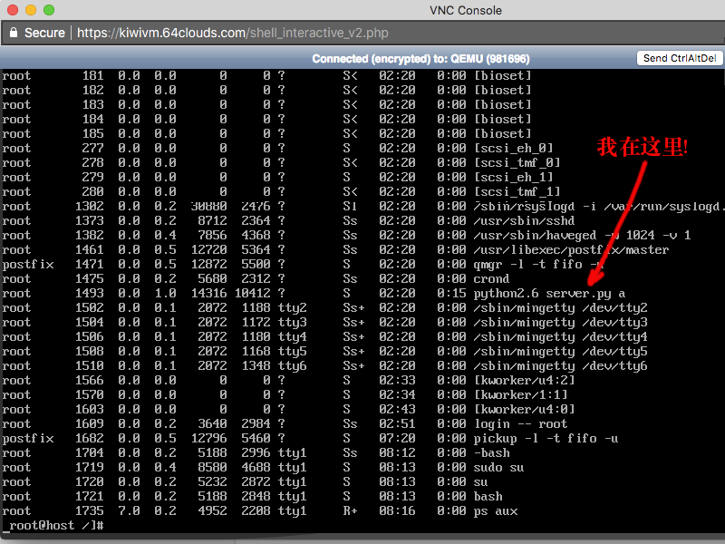
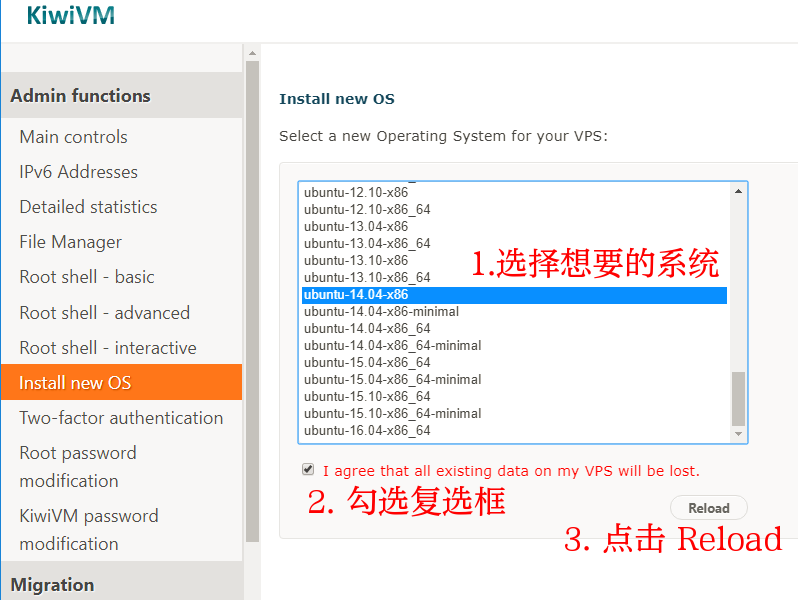
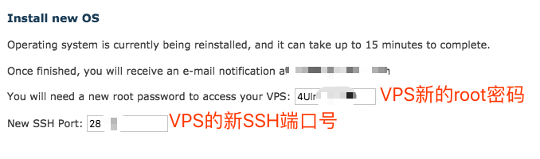
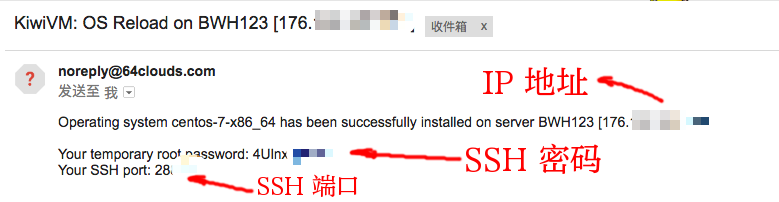

# 纯手工搭建 ShadowsocksR 服务器教程 (搬瓦工主机)


## 索引
- [前言](#前言)
- [登录搬瓦工主机](#登录搬瓦工主机)
- [纯手工安装 ShadowsocksR (SSR) 服务器软件](#纯手工安装-shadowsocksr-ssr-服务器软件)
- [防火墙 (Firewall)](#防火墙-firewall)
- [重装操作系统](#重装操作系统)

## 前言
由于 搬瓦工 目前已经将 一键安装 SS/SSR 功能取消了. 特编写此详细手工安装 SSR 服务器 教程. 

我希望一无所知的小白也能按此教程完成安装. 看到这篇文章的人, 请以任何方式转发到网络上的任何地方. 作者放弃版权.

至于 搬瓦工 VPS 的购买小白教程, 请戳 [这里](https://github.com/OneSecure/ShadowAgentNotes/blob/master/KillGFW.md)

> * 提醒一句. 由于搬瓦工网站已经被墙, 本文的所有操作必须在你已经使用别的方式翻着墙的状态下进行.
> * 重要提示: 记得把你的输入法切换成英文输入模式. 这很重要.
> * 如果你会使用远程登录工具 [PuTTY](https://www.chiark.greenend.org.uk/~sgtatham/putty/) 软件是最好不过的了, 它可以极大提高你的操作效率. 由于过多细枝末节会干扰读者将注意力集中到最主要的工作上,这里就不再赘述, 详情请自行 Google.

## 登录搬瓦工主机

1. 首先停止 VPS 主机. 在 `Main controls` 页面, 点击 `stop` 按钮, 就停止了主机. 

   下图中有两个参数很重要, 请复制粘贴保存到安全的地方, 以后可能用得到, 一个是 `IP address`, 另一个是 `SSH port`.

    

2. 在 `Root password modification` 页面, 点击 `Generate and set new root password` 按钮. 
    系统就为你生成新的 `root` 密码.
   
    
    
    请返回到第 1 步, 在 `Main controls` 页面, 点击 `start` 按钮, 再次启动 VPS 主机, 否则下面第 3 步会报错.
   
    * 请注意, 系统`不会`为你`保存`这里生成的`密码`, 请马上将其复制粘贴`保存`到一个`安全的地方`.方便下次登录时重复使用不用再次生成.
    * 如果你不幸一再在这一步操作失败, 老是出现上图所示的错误信息. 那就 [重装操作系统](#重装操作系统) 吧. 

3. 在 `Root shell - interactive` 页面, 点击 `Launch` 按钮. 就进入了 `Linux` 的字符界面了.

    

4. 在出现的 `Linux` 登录界面上, 请在 `host login:` 后面键入账号名 `root` 这四个字符并回车. 
    在随后出现的 `Password:` 后摸黑键入上面生成的密码并回车.
    如果出现下图的界面, 表明成功登录 Linux 主机.
    
    > * 搬瓦工早期提供的 Linux 系统不需要登录, 这一步就略过了. 
    > * 密码在输入时不会显示, 你摸黑输入即可, 如果输错了会提示你重新输入的.
    
    
    
## 纯手工安装 ShadowsocksR (SSR) 服务器软件
    
5. 现在, 开始安装 `SSR` 的流程. 请逐行键入以下命令并回车, 不要复制粘贴, 否则吃不了兜着走. 
    
    > * 下列命令中从`井号`到`行末`的内容是注释, 不要输入(没中文输入法, 想输也输不了).
    > * 下文涉及的 `yum` 命令是 `CentOS` 系统的软件安装命令, `ubuntu` 和 `Debian` 等系统的对应命令是 `apt-get` 或 `apt`.
    
    ```bash
    sudo su                               # 将当前账号的权限切换到超级用户(switch user, 简写为 su)
    cd /                                  # 将当前工作路径切换到根目录, 注意 cd 和 斜杠 之间的 空格 别漏了.
    yum install git -y                    # 安装 git 软件. 如果是 ubuntu 系统请用 apt-get 替换命令中的 yum 字样.
    git clone https://github.com/koolshare/shadowsocksr.git  # 用 git 命令拉取 SSR 源代码
    cd shadowsocksr                       # 进入 SSR 软件目录
    sh ./initcfg.sh                       # 执行 SSR 配置文件的初始化, 这一步将创建 user-config.json 配置文件
    vi /shadowsocksr/user-config.json     # 运行 vi 编辑器修改配置文件. 下文第 6 节详述
    vi /etc/rc.local                      # 运行 vi 编辑器修改或创建 Linux 自启动脚本文件 rc.local 下文第 7 节详述
    chmod +x /etc/rc.local                # 为 自启动脚本文件 rc.local 添加 可执行文件 属性
    reboot                                # 配置完毕后, 重启 Linux 主机
    ```

6. 使用 `vi` 修改 `user-config.json` 配置文件
    
    启动 `vi` 编辑 `user-config.json` 的命令如下. 该命令在第 5 节里有写, 这里重复一次.
    
    ```bash
    vi /shadowsocksr/user-config.json
    ```

    如果你进入 `vi` 后两眼一抹黑, 手足无措, 请先看下列极简 `vi` 入门手册. 

    > * `vi` 是 Linux 内置的文字编辑器, 是文本界面, 而不是图形界面, 其违反直觉的傻逼操作方式咱就忍忍吧, 很快就过去了.
    > * `vi` 创建或打开文件后, 文件是 `只读` 的, 也就是说这时不能修改. 必须按下 `i` 键后, 文件才处于可编辑模式.
    > 这时屏幕左下角会出现 `-- INSERT --` 字样标记着这个状态, 这时就可以输入文字了. 可以使用上下左右键移动光标. 鼠标不管用的.
    > * 当编辑完毕以后, 需要保存退出, 要首先按键盘左上角的 `Esc` 键, 这时 `-- INSERT --` 标记消失, 表明文件又进入只读模式了.
    > 这时再输入 `:wq` 就是保存(**w**rite)退出(**q**uit)了, 注意最开始的冒号别看漏了, 
    > 这些命令字符也显示在屏幕左下角.
    > * 如果你打开一个文件后并没有修改它, 可以使用 `:q` 命令(冒号**q**uit)退出 `vi`.
    > * 如果你打开一个文件并做了些修改, 但你反悔了不想保存你的修改, 使用 `:q!` 命令(冒号**q**uit感叹号)退出 `vi`.

    首先按下 `i` 键让 `vi` 进入编辑模式. 这时可以使用 `上下左右键` 移动光标, `删除键` 删除字符. 但 `鼠标` 是不能用的.

    对配置文件 `user-config.json` 主要修改两处, `server_port` 和 `password` 的值, 看下图.
    
    改好之后, 按下 `Esc` 并用 `:wq` 命令保存退出.

    
    
7. 使用 `vi` 修改或创建 自启动脚本 `/etc/rc.local` 文件  
    
    启动 `vi` 编辑 `/etc/rc.local` 的命令如下. 
    
    ```bash
    vi /etc/rc.local
    ```
    并按 `i` 键让 `vi` 进入编辑模式.
    
    我们必须保证 `rc.local` 文件的第一行是 `#!/bin/bash` , 这是确定这个文件被解释为 `可执行` 的 `bash` 脚本的标志.
    
    然后, 我们在文件的最后加上 `/shadowsocksr/shadowsocks/logrun.sh` 语句, 它就是 SSR 软件的启动命令.
    
    经过修改后的 `rc.local` 文件像下面这样.
    
    ```bash
    #!/bin/bash
    #
    # 其它语句...
    #
    /shadowsocksr/shadowsocks/logrun.sh
    ```
    
    如下图. 然后按下 `Esc` 并用 `:wq` 命令保存退出.
    
    
    
    为了保证 `rc.local` 文件有 `可执行` 属性. 我们执行 `chmod +x /etc/rc.local` 命令给它加上, 
    虽然一般说来它是有这属性的, 为图省事儿还是来一家伙. 俗话说`有枣没枣打一杆子`就是这种情况.
    
8. 重启 VPS 主机
    
    到这里, `SSR` 的配置工作差不多就做完了. 
    为了验证我们工作的有效性, 使用 `reboot` 命令重启 VPS.
    然后用第 4 节描述的方法再次用 `root` 账号和密码登录主机.
    最后用 `ps aux` 命令查看进程列表, 看有没有 `python2.6 server.py a` 信息, 如果有就配好啦. 如下图.
    如果没有, 那再照文章重做一遍, 直到弄好为止.
    
    
        
9. 配置整理    
    
    | 参数名称 |  参数值  | 
    | ------- | ------- | 
    | 服务器IP | 你VPS的IP (本教程第 1 节配图里的 `IP address` 就是) |
    | 服务器端口 | 你在第 6 节设定的端口值 |
    | 密码 | 你在第 6 节设定的密码 |
    | 加密方式 | aes-128-ctr |
    | 协议 | auth_aes128_md5 |
    | 混淆 | tls1.2_ticket_auth |

    然后你就可以使用这些参数设置你的 iPhone / Android / 平板 / PC 上的 SSR 客户端啦.

## 防火墙 (firewall)

如果你按照以上教程一步不错地走完了, 还是翻不了墙, 那就有可能是系统防火墙的配置问题, 它挡住了你手机连接这个 VPS 的你前文设定的端口,
那就永久性地关闭这玩意儿好了. 操作步骤如下
    
```bash
chkconfig --level 35 iptables off
/etc/init.d/iptables stop  
iptables -P INPUT DROP  
```

## 重装操作系统
    
   1. 先停掉主机, 如教程[正文第 1 步](#步骤) 所言. 然后点击左侧的 `Install new OS` 跳到操作系统选择页面，如图：
        
   
            
   2. 建议选择 `ubuntu-16.04-x86_64`, 勾选复选框, 点击 `Reload` 之后，提示正在重装，且把新的 `VPS` 的 `root` `密码` 和 `SSH` `端口号` 展示给了我们, 请马上将它们复制粘贴 `保存` 到一个 `安全的地方`. 这很重要, 否则你可能被迫再次重装系统.
        
   
            
   3. 这是我们登录 `VPS` 的凭证，如果没有保存，重装好后 `搬瓦工` **可能** 会给我们发送一封邮件，里面也包含了这部分信息，如图：
        
   
            
   4. 这就是我们登录 `VPS` 的新凭证，如果没有收到，去垃圾箱找找，说不定被分类到垃圾箱了。如果还找不到就自认倒霉再次重装系统吧.
