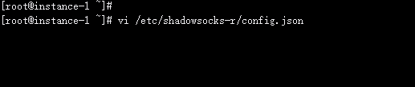
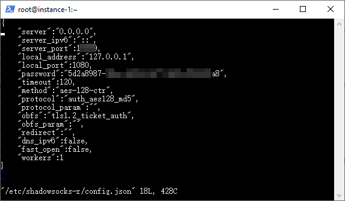
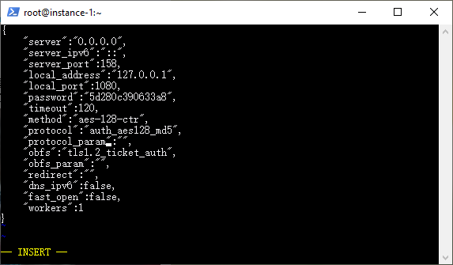
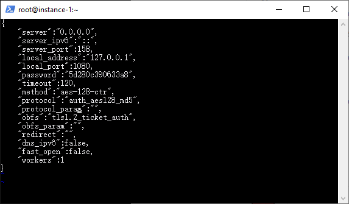
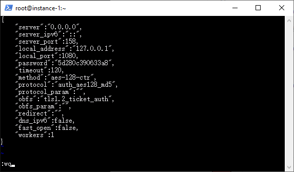
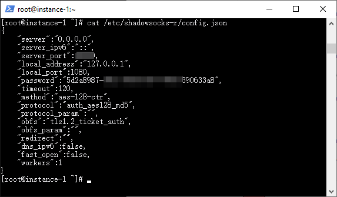

VI 文本编辑器 极简教程
========

* `vi` 是 `Linux` 内置的文字编辑器, `文本`界面, 而`不是`图形界面, 其违反直觉的傻逼操作方式咱就咬牙学会吧, 没别的选择, 况且也死不了人.

* `vi` 创建或打开文件后, 文件是 `只读` 的, 也就是说这时不能修改. 必须按下 `i` 键后, 文件才处于 `可编辑` 模式. 这时屏幕左下角会出现 `-- INSERT --` 字样标记着这个状态, 这时就 `可以` 输入文字了. 可以使用上下左右键移动光标. 

* 提醒一下, `鼠标`是不管用的.

* 当编辑完毕以后, 需要保存退出, 要首先按键盘左上角的 `Esc` 键, 这时 `-- INSERT --` 标记消失, 表明文件又进入只读模式了. 这时再输入 `:wq` 就是保存(`write`)退出(`quit`)了, 注意最开始的 `冒号` 别看漏了, 这些命令字符也显示在屏幕左下角.

* 如果你打开一个文件后并没有修改它, 可以使用 `:q` 命令(冒号`quit`)退出 `vi`.

* 如果你打开一个文件并做了些修改, 但你反悔了不想保存你的修改, 使用 `:q!` 命令(冒号`quit`感叹号)退出 `vi`.

# 图文演练

1. 在 `Linux` 终端命令行, 输入 `vi /etc/shadowsocks-r/config.json` 并回车. 这行命令的意思是, 打开位于路径 `/etc/shadowsocks-r/` 的 `config.json` 文件准备编辑, 如果该文件不存在, 将在你保存的时候创建它. 
 
    > 这里的示例文件有点特殊, 必须有 `系统管理员` 权限才可以修改, 抱歉. 获取 `管理员` 权限的命令是 `sudo su`.

2. 文件打开以后的样子见下图. 注意这个时候是 `不能` 编辑修改的.

3. 这时, 按下 `i` 键, 编辑器就变成了下面的样子, 注意 `-- INSERT --` 字样的标识符. 这就可以随意编辑修改了. 注意鼠标还是不能用的哟.

4. 修改编译完毕以后, 按下 `Esc` 键, 这时 编辑器下侧的 `-- INSERT --` 标识消失, 又回到 `只读` 状态, 不能修改了. 如下图.

5. 这时候, 输入 `:wq` 并敲 `回车` 就可以保存退出了, 如下图. 当然, 不保存退出是 `:q!`, 前面已经说过了.

6. 最后检查修改后的文件的正确性, 可以使用 `cat` 命令, 即 `cat /etc/shadowsocks-r/config.json`, 就把文件的内容显示出来了. 如下图.

# 参考资料

* [Linux vi/vim 菜鸟教程](http://www.runoob.com/linux/linux-vim.html)
* [Linux vi 从入门到精通](https://segmentfault.com/a/1190000009083255)
