# 在 Vultr 主机上搭建 SSR 服务器 图文教程

<a href="https://www.vultr.com/?ref=7583029"></a>

- 说明: [Vultr](https://www.vultr.com/?ref=7583029) 的 VPS 网速不是很快, 但好处是显而易见的: 部署相对简单, **可以随意换 IP**, 仅凭这一点, 其重要性对 `墙国` 网民就够了. 当 虚拟主机 IP 被墙, 可以删掉此主机, 再创建一新的, IP 就变了, 举手之劳.

## 索引
- [创建虚拟主机](#创建虚拟主机)
- [部署 ShadowsocksR (SSR) 服务器](#部署-shadowsocksr-ssr-服务器)
- [防火墙](#防火墙)

## 创建虚拟主机

1. 在 [Vultr](https://www.vultr.com/?ref=7583029) 上注册帐户并登录.

2. 如果你新注册的账号, `Vultr` 会有 $10 美元的赠金. 当然你得首先 `充值至少 $10 美元` 后赠金才可能到账. 
   充值的方式有 `信用卡`, `Paypal (贝宝)`, `支付宝 (Alipay)`, `微信支付 (WeChat Pay)` 等等, 非常方便.
   下图是作者使用 `Paypal` 充值的图文过程.

   注意, 赠金必须在90天内花完, 否则过期作废.

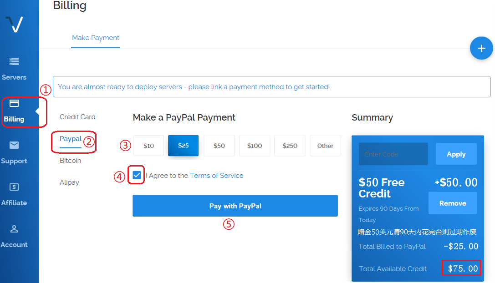

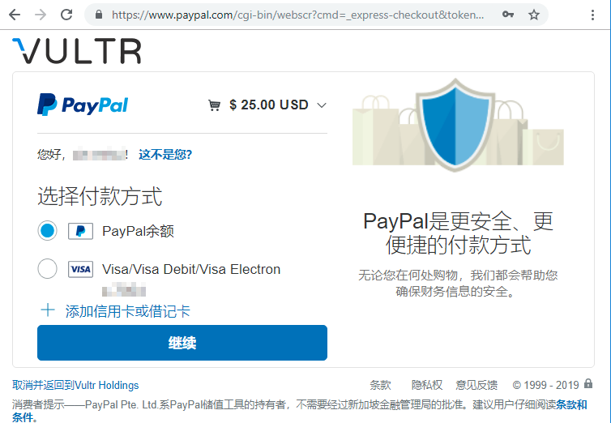

3. 然后回到 `Servers` 标签页, 点击右侧的加号 `+` 创建虚拟主机.

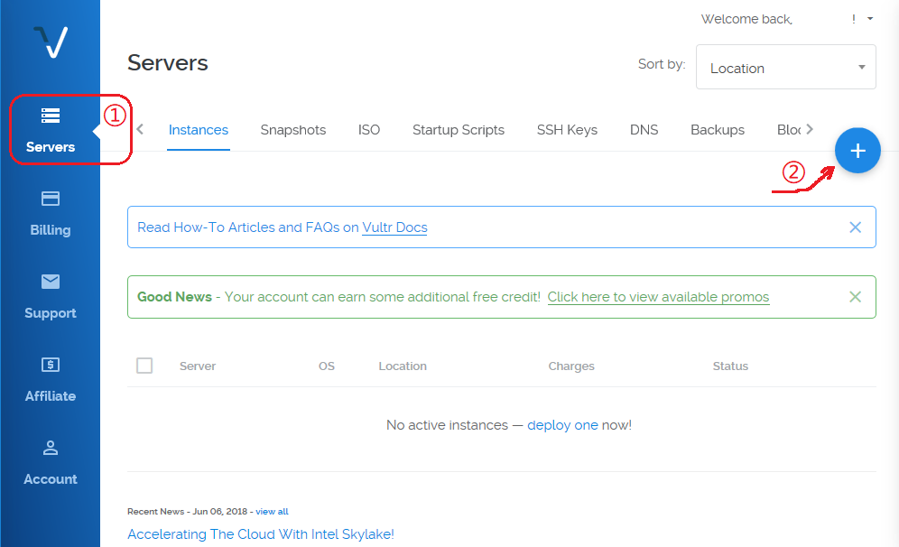

4. 选择主机机房的位置, 有 `日本`, `新加坡`, `荷兰`, `法国`, `德国`, `英国`, `澳洲`, `美国` 等供选择, 
   作者随意选了个 `亚特兰大`, 发现白天还行, 晚上就较慢; 据说 `日本` 的也较慢, 慎选; 另据说 `硅谷` 的不错, 希望是真的.

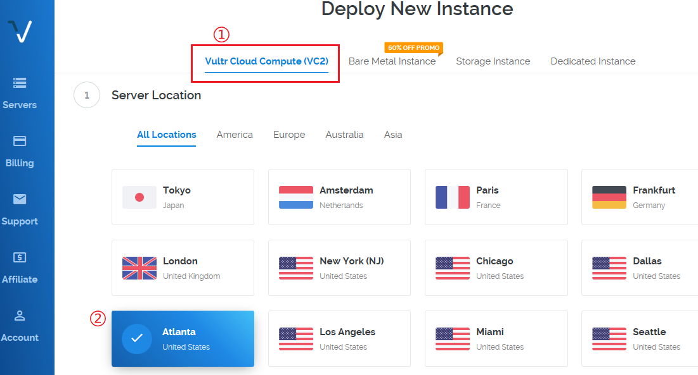

5. 选择 `操作系统` 类型, 建议选择 `CentOS 7 x64`

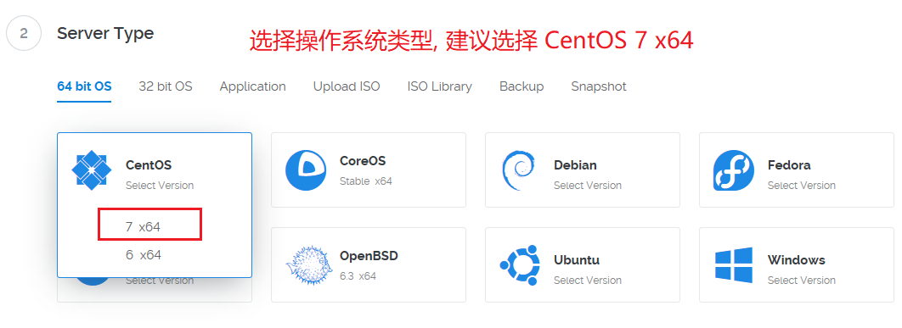

6. 主机容量, 选 3.50 美元每月 档次的, 支持 IPv4, 500GB 每月 流量, 可劲 `造` 也用不完.

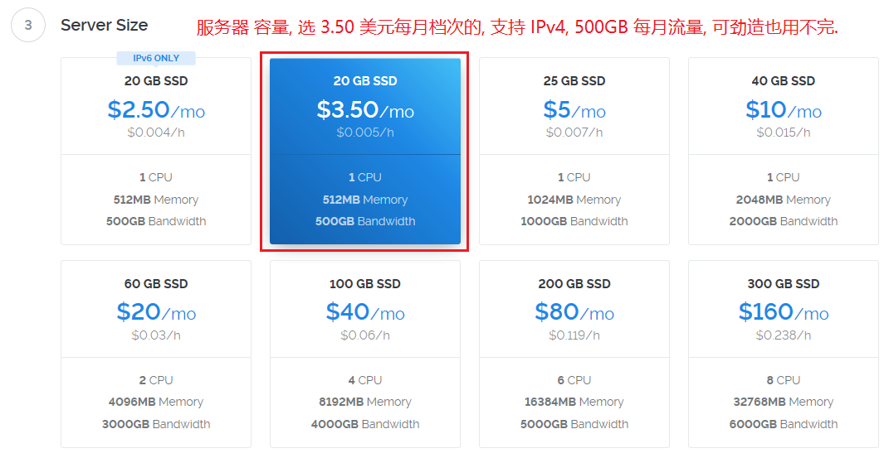

7. 剩下的就没什么了, 第七栏, 填写主机名, 作者填的是 `v-01`, 你们随意. 
   最后点击 `部署` (Deploy Now), 完成 虚拟主机 的创建. 过程持续 5 分钟左右.

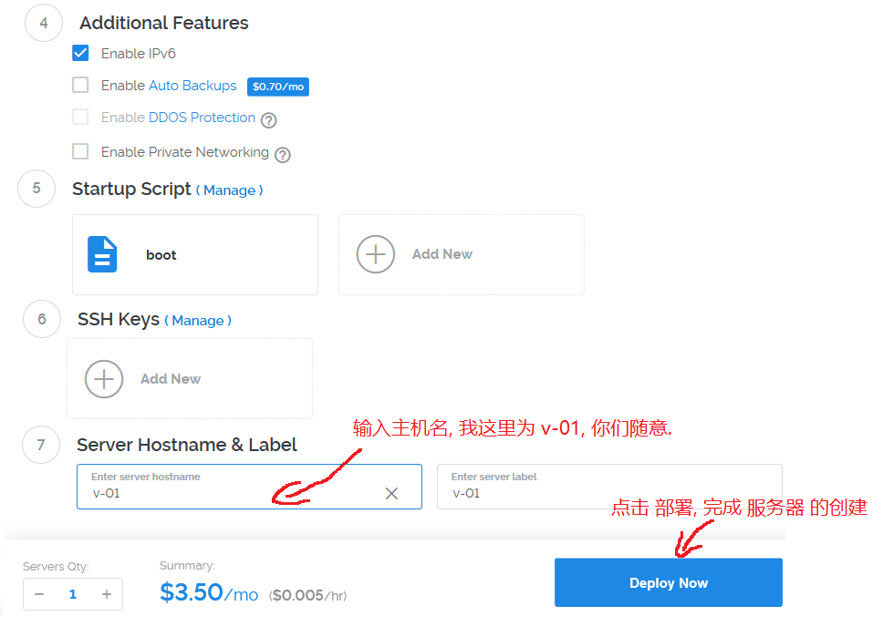

8. 创建好的主机像下图的样子, 点击 `Manage` 按钮进入主机信息页面.

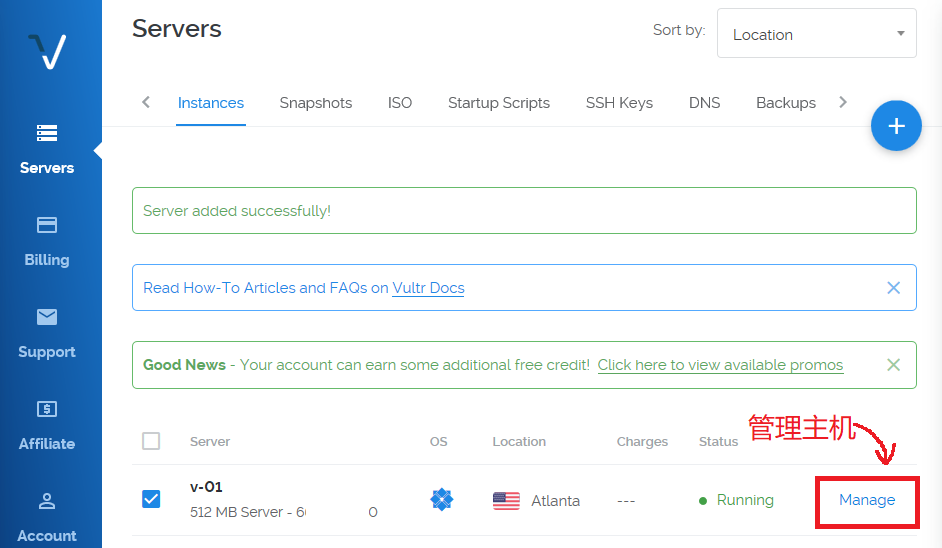

9. 在 `主机信息` 页面, 可以看到 `IP Address`(IP地址), 用户名 root, 登录密码 等关键信息. 
   这里把 `SSH` 端口号 `22` 漏掉了, 作者用红字添了上去. 
   
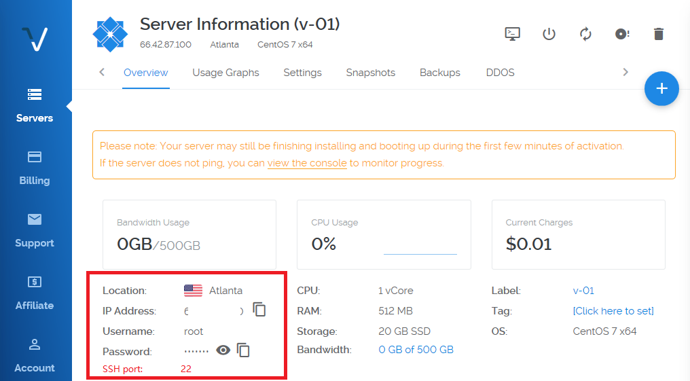

   由于很多 IP 已经被 GFW 屏蔽, 安装完成, 并从控制台确认系统已经在运行以后, 请在 [这个网站](http://mip.chinaz.com/Ip/Port/) 上用主机 IP 和 22 端口试一下, 如下图看是否畅通, 如果不通, 请再次新建 `虚拟主机`, 直到试通为止. 然后再把不用的虚拟主机删除. 

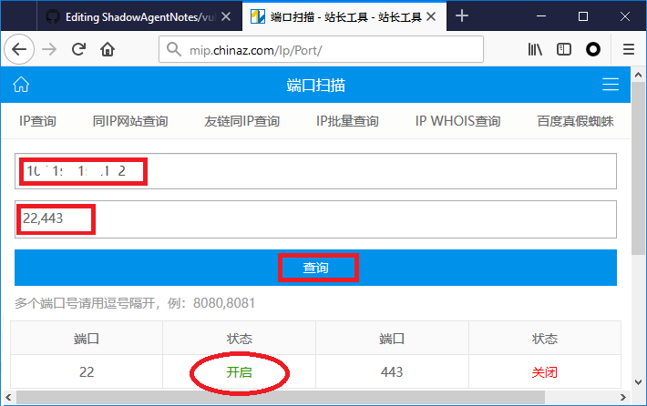

   最后, 如下图所示, 以 `root` 用户名 和 `密码` 登入主机. 


## 部署 ShadowsocksR (SSR) 服务器

在主机内的命令行窗口敲入以下命令.

每次输入一行、回车，等待屏幕上的操作完成后再输入下一条。

注意, 第二行相当长, 以 `.sh` 结尾, 请耐心正确地输入完毕, 然后敲回车.

```bash
sudo su

wget --no-check-certificate https://raw.githubusercontent.com/teddysun/shadowsocks_install/master/shadowsocksR.sh

chmod +x shadowsocksR.sh

./shadowsocksR.sh 2>&1 | tee ssr.log
```

最后一步输入完毕并回车后，你应该会看到有几个地方询问你, 要求你填写密码, 监听端口号, 选定协议, 等等, 按照提示输入你自己的选项并回车即可。

如果你懒, 一路回车也可以, 脚本会用预设值为你生成配置. 

然后你什么都不用做，只需要静静地等它运行完毕就好。结束后你就会看到部署好的 ShadowsocksR 的配置信息。
下图是作者的安装结果.

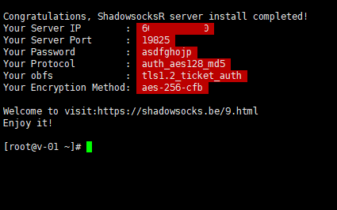

记下红色高亮的内容，就是服务器 IP、服务器端口、你设的密码和加密方式, 混淆, 协议 等等配置信息, 
把它们输入你手机, 电脑上的 SSR 客户端就可以 翻墙啦。

## 小贴士

上述配置信息会保存在当前目录下, 以下列命令可以再次显示上图的信息.
```
cat ssr.log
```
如果你不确定`日志`文件 `ssr.log` 在不在, 可以用 `ls` 命令列出当前目录下的所有文件, 看看它是否在列.

如果你不确定服务器 `IP` 是否已改变, 可用下列命令找回本机的 `公网` `IP`.
```
curl -s checkip.dyndns.org | sed 's/.*IP Address: \([0-9\.]*\).*/\1/g'
```
如果你想重新安装或者不想保留这个 `SSR` 服务器了, 可以 `卸载` 它, 命令如下.
```
./shadowsocksR.sh uninstall
```

## 防火墙

Vultr 的虚拟主机默认打开所有 TCP 端口, 但关闭了所有 UDP 端口. 
如果你想开启 UDP 转发, 请运行 如下命令 停掉整个防火墙, 就可以转发了.
```
systemctl stop firewalld
```
